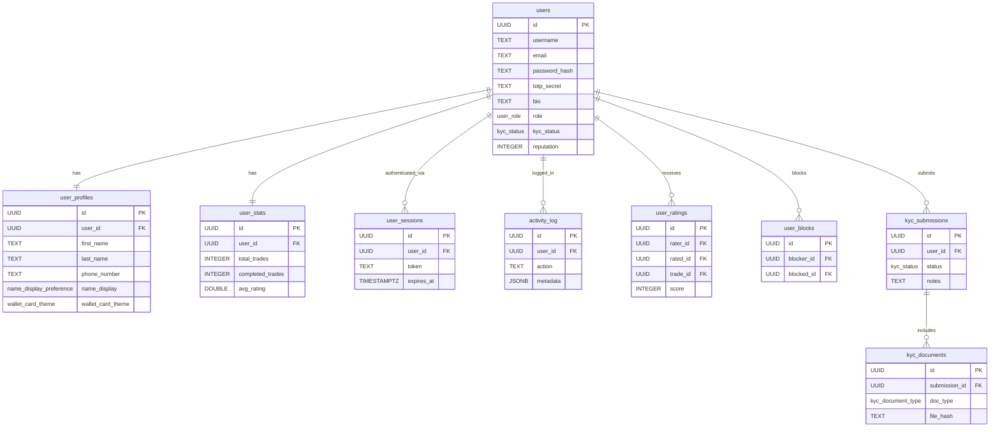
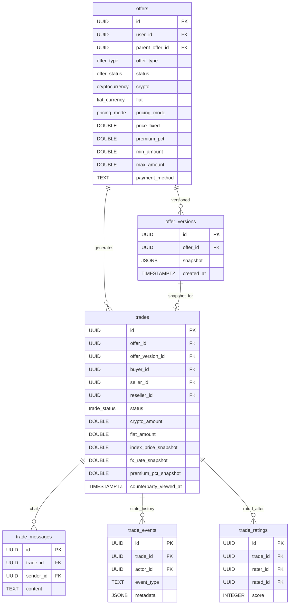
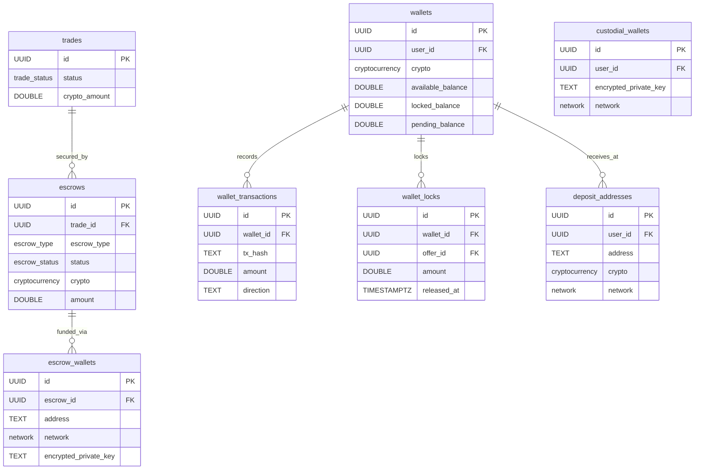
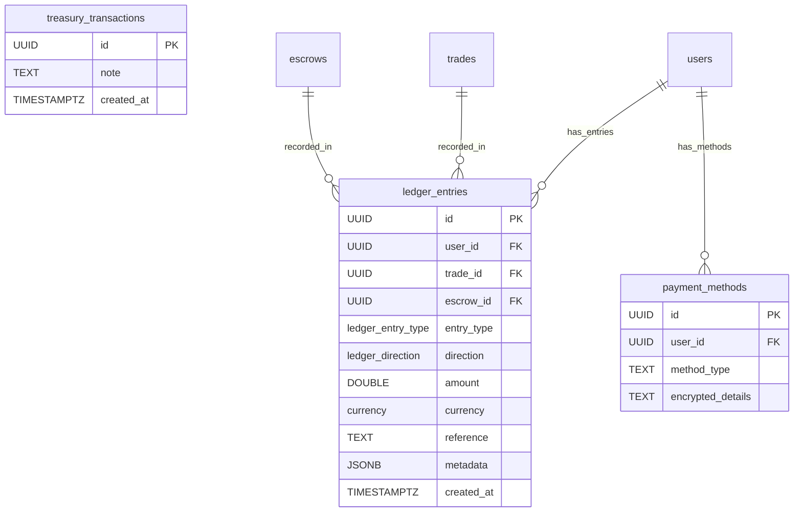
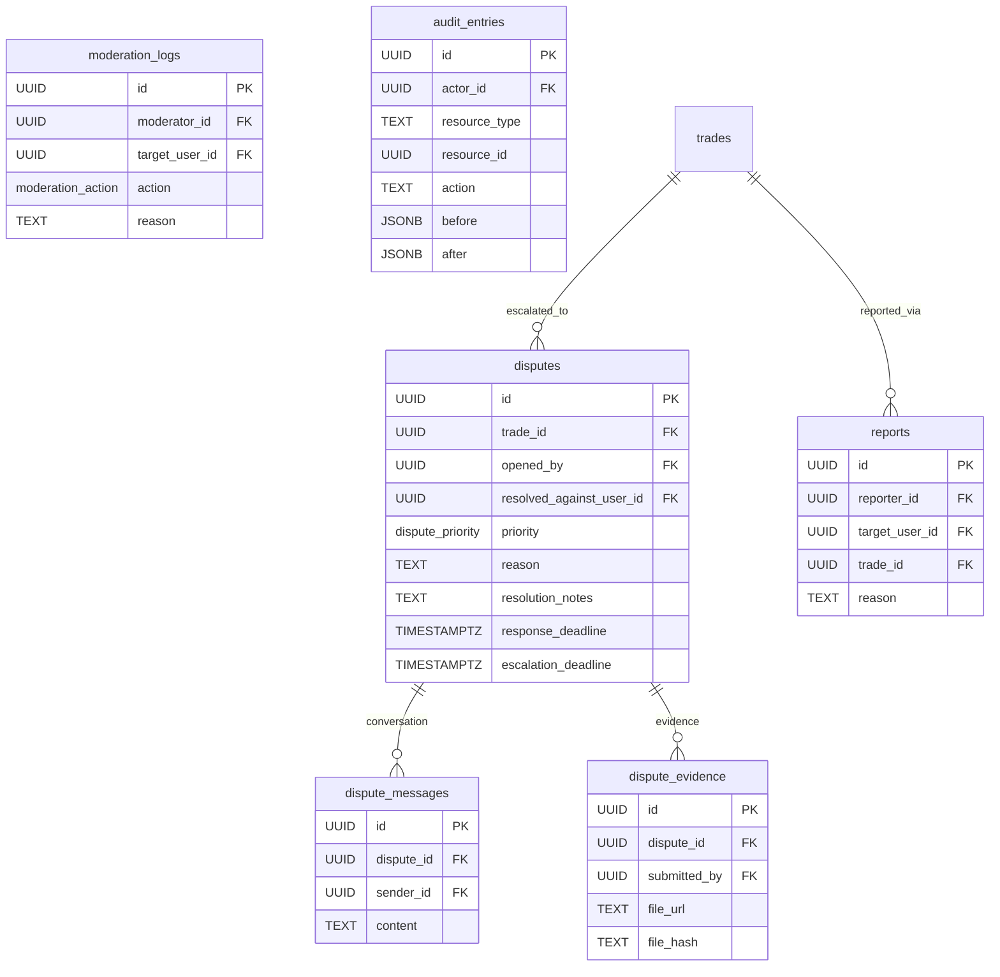
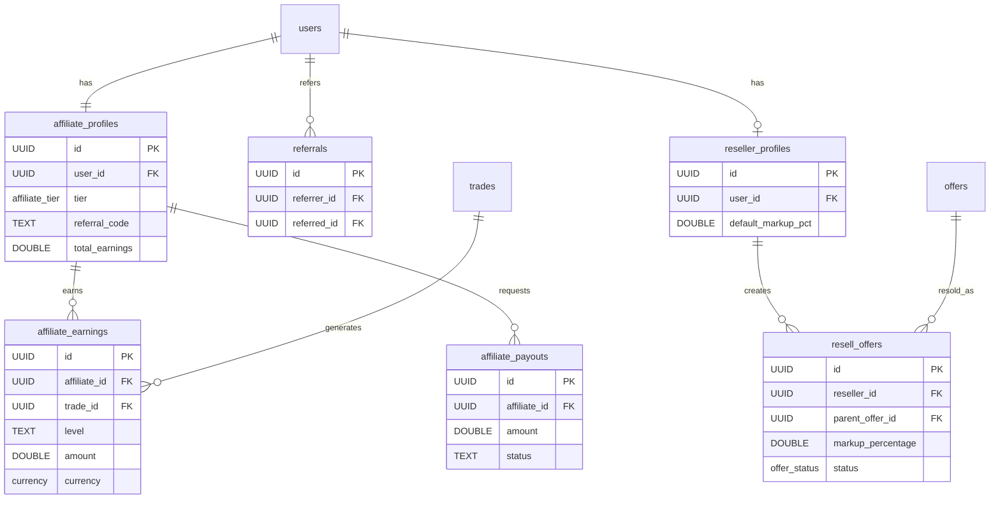
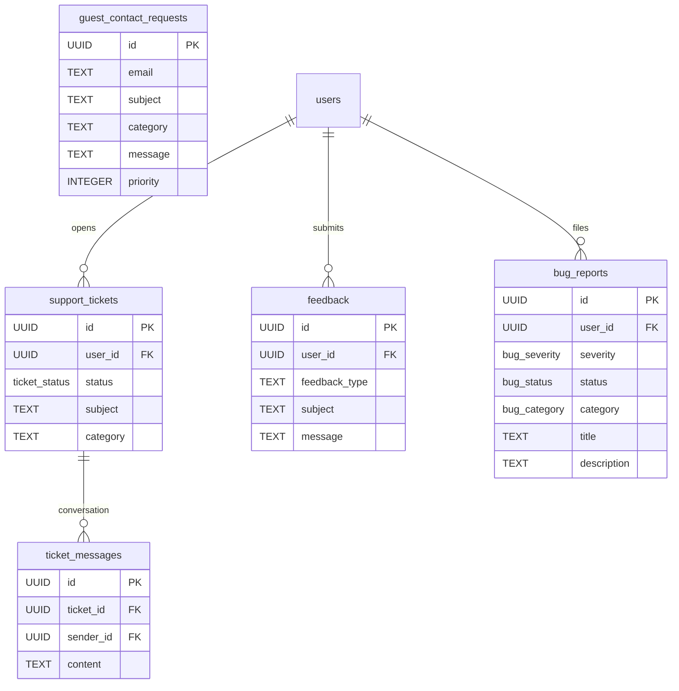
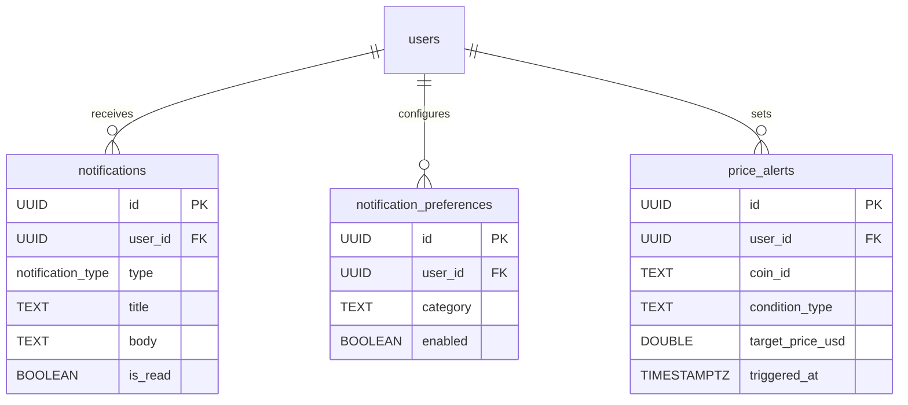
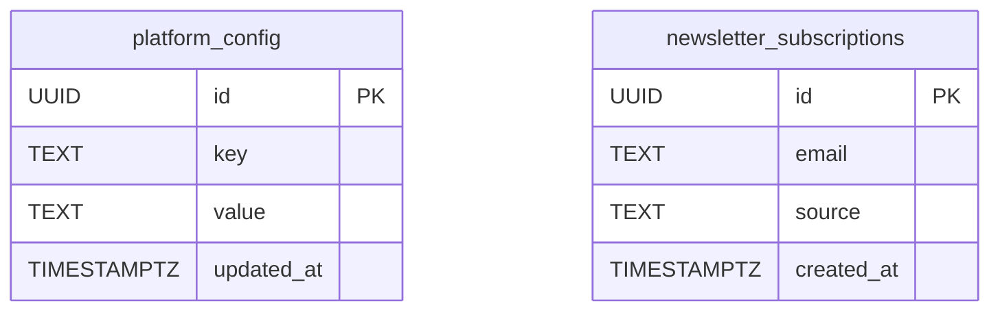

# QIC Trader — Database Schema

> Generated from migrations `001–036`. All tables, FKs, and key columns included.

---

## Full Schema Overview

```mermaid
erDiagram
    users {
        UUID id PK
        TEXT username
        TEXT email
        TEXT password_hash
        TEXT totp_secret
        TEXT bio
        user_role role
        kyc_status kyc_status
        INTEGER reputation
        TIMESTAMPTZ created_at
        TIMESTAMPTZ updated_at
    }
    user_profiles {
        UUID id PK
        UUID user_id FK
        TEXT first_name
        TEXT last_name
        TEXT phone_number
        TEXT phone_country_code
        name_display_preference name_display
        wallet_card_theme wallet_card_theme
        TIMESTAMPTZ created_at
        TIMESTAMPTZ updated_at
    }
    user_stats {
        UUID id PK
        UUID user_id FK
        INTEGER total_trades
        INTEGER completed_trades
        DOUBLE avg_rating
        TIMESTAMPTZ updated_at
    }
    user_sessions {
        UUID id PK
        UUID user_id FK
        TEXT token
        TIMESTAMPTZ expires_at
        TIMESTAMPTZ created_at
    }
    activity_log {
        UUID id PK
        UUID user_id FK
        TEXT action
        JSONB metadata
        TIMESTAMPTZ created_at
    }
    user_ratings {
        UUID id PK
        UUID rater_id FK
        UUID rated_id FK
        UUID trade_id FK
        INTEGER score
        TEXT comment
        TIMESTAMPTZ created_at
    }
    user_blocks {
        UUID id PK
        UUID blocker_id FK
        UUID blocked_id FK
        TIMESTAMPTZ created_at
    }
    offers {
        UUID id PK
        UUID user_id FK
        UUID parent_offer_id FK
        UUID reseller_user_id FK
        offer_type offer_type
        offer_status status
        cryptocurrency crypto
        fiat_currency fiat
        DOUBLE price_fixed
        DOUBLE premium_pct
        pricing_mode pricing_mode
        DOUBLE markup_percentage
        DOUBLE min_amount
        DOUBLE max_amount
        TEXT payment_method
        TIMESTAMPTZ created_at
        TIMESTAMPTZ updated_at
    }
    offer_versions {
        UUID id PK
        UUID offer_id FK
        JSONB snapshot
        TIMESTAMPTZ created_at
    }
    trades {
        UUID id PK
        UUID offer_id FK
        UUID offer_version_id FK
        UUID buyer_id FK
        UUID seller_id FK
        UUID reseller_id FK
        trade_status status
        DOUBLE crypto_amount
        DOUBLE fiat_amount
        DOUBLE index_price_snapshot
        DOUBLE fx_rate_snapshot
        DOUBLE premium_pct_snapshot
        TIMESTAMPTZ counterparty_viewed_at
        TIMESTAMPTZ created_at
        TIMESTAMPTZ updated_at
    }
    trade_messages {
        UUID id PK
        UUID trade_id FK
        UUID sender_id FK
        TEXT content
        TIMESTAMPTZ created_at
    }
    trade_events {
        UUID id PK
        UUID trade_id FK
        UUID actor_id FK
        TEXT event_type
        JSONB metadata
        TIMESTAMPTZ created_at
    }
    trade_ratings {
        UUID id PK
        UUID trade_id FK
        UUID rater_id FK
        UUID rated_id FK
        INTEGER score
        TEXT comment
        TIMESTAMPTZ created_at
    }
    escrows {
        UUID id PK
        UUID trade_id FK
        escrow_type escrow_type
        escrow_status status
        cryptocurrency crypto
        DOUBLE amount
        TIMESTAMPTZ created_at
        TIMESTAMPTZ updated_at
    }
    escrow_wallets {
        UUID id PK
        UUID escrow_id FK
        TEXT address
        network network
        TEXT encrypted_private_key
        TIMESTAMPTZ created_at
    }
    wallets {
        UUID id PK
        UUID user_id FK
        cryptocurrency crypto
        DOUBLE available_balance
        DOUBLE locked_balance
        DOUBLE pending_balance
        TIMESTAMPTZ created_at
        TIMESTAMPTZ updated_at
    }
    wallet_transactions {
        UUID id PK
        UUID wallet_id FK
        TEXT tx_hash
        DOUBLE amount
        TEXT direction
        TIMESTAMPTZ created_at
    }
    wallet_locks {
        UUID id PK
        UUID wallet_id FK
        UUID offer_id FK
        DOUBLE amount
        TIMESTAMPTZ created_at
        TIMESTAMPTZ released_at
    }
    deposit_addresses {
        UUID id PK
        UUID user_id FK
        TEXT address
        cryptocurrency crypto
        network network
        TIMESTAMPTZ created_at
    }
    custodial_wallets {
        UUID id PK
        UUID user_id FK
        TEXT encrypted_private_key
        network network
        TIMESTAMPTZ created_at
    }
    ledger_entries {
        UUID id PK
        UUID user_id FK
        UUID trade_id FK
        UUID escrow_id FK
        ledger_entry_type entry_type
        ledger_direction direction
        DOUBLE amount
        currency currency
        TEXT reference
        JSONB metadata
        TIMESTAMPTZ created_at
    }
    payment_methods {
        UUID id PK
        UUID user_id FK
        TEXT method_type
        TEXT encrypted_details
        TIMESTAMPTZ created_at
    }
    disputes {
        UUID id PK
        UUID trade_id FK
        UUID opened_by FK
        UUID resolved_against_user_id FK
        dispute_priority priority
        TEXT reason
        TEXT resolution_notes
        TIMESTAMPTZ response_deadline
        TIMESTAMPTZ escalation_deadline
        TIMESTAMPTZ created_at
        TIMESTAMPTZ updated_at
    }
    dispute_messages {
        UUID id PK
        UUID dispute_id FK
        UUID sender_id FK
        TEXT content
        TIMESTAMPTZ created_at
    }
    dispute_evidence {
        UUID id PK
        UUID dispute_id FK
        UUID submitted_by FK
        TEXT file_url
        TEXT file_hash
        TIMESTAMPTZ created_at
    }
    moderation_logs {
        UUID id PK
        UUID moderator_id FK
        UUID target_user_id FK
        moderation_action action
        TEXT reason
        TIMESTAMPTZ created_at
    }
    audit_entries {
        UUID id PK
        UUID actor_id FK
        TEXT resource_type
        UUID resource_id
        TEXT action
        JSONB before
        JSONB after
        TIMESTAMPTZ created_at
    }
    notifications {
        UUID id PK
        UUID user_id FK
        notification_type type
        TEXT title
        TEXT body
        BOOLEAN is_read
        TIMESTAMPTZ created_at
    }
    notification_preferences {
        UUID id PK
        UUID user_id FK
        TEXT category
        BOOLEAN enabled
        TIMESTAMPTZ updated_at
    }
    kyc_submissions {
        UUID id PK
        UUID user_id FK
        kyc_status status
        TEXT notes
        TIMESTAMPTZ submitted_at
        TIMESTAMPTZ reviewed_at
    }
    kyc_documents {
        UUID id PK
        UUID submission_id FK
        kyc_document_type doc_type
        TEXT file_url
        TEXT file_hash
        TIMESTAMPTZ created_at
    }
    support_tickets {
        UUID id PK
        UUID user_id FK
        ticket_status status
        TEXT subject
        TEXT category
        TIMESTAMPTZ created_at
        TIMESTAMPTZ updated_at
    }
    ticket_messages {
        UUID id PK
        UUID ticket_id FK
        UUID sender_id FK
        TEXT content
        TIMESTAMPTZ created_at
    }
    reports {
        UUID id PK
        UUID reporter_id FK
        UUID target_user_id FK
        UUID trade_id FK
        TEXT reason
        TIMESTAMPTZ created_at
    }
    bug_reports {
        UUID id PK
        UUID user_id FK
        bug_severity severity
        bug_status status
        bug_category category
        TEXT title
        TEXT description
        TEXT steps_to_reproduce
        TEXT environment
        TIMESTAMPTZ created_at
    }
    guest_contact_requests {
        UUID id PK
        TEXT email
        TEXT name
        TEXT subject
        TEXT category
        TEXT message
        INTEGER priority
        TIMESTAMPTZ created_at
    }
    feedback {
        UUID id PK
        UUID user_id FK
        TEXT email
        TEXT feedback_type
        TEXT subject
        TEXT message
        TIMESTAMPTZ created_at
    }
    affiliate_profiles {
        UUID id PK
        UUID user_id FK
        affiliate_tier tier
        TEXT referral_code
        DOUBLE total_earnings
        TIMESTAMPTZ created_at
    }
    referrals {
        UUID id PK
        UUID referrer_id FK
        UUID referred_id FK
        TIMESTAMPTZ created_at
    }
    affiliate_earnings {
        UUID id PK
        UUID affiliate_id FK
        UUID trade_id FK
        TEXT level
        DOUBLE amount
        currency currency
        TIMESTAMPTZ created_at
    }
    affiliate_payouts {
        UUID id PK
        UUID affiliate_id FK
        DOUBLE amount
        TEXT status
        TIMESTAMPTZ requested_at
        TIMESTAMPTZ paid_at
    }
    reseller_profiles {
        UUID id PK
        UUID user_id FK
        DOUBLE default_markup_pct
        TIMESTAMPTZ created_at
    }
    resell_offers {
        UUID id PK
        UUID reseller_id FK
        UUID parent_offer_id FK
        DOUBLE markup_percentage
        offer_status status
        TIMESTAMPTZ created_at
    }
    price_alerts {
        UUID id PK
        UUID user_id FK
        TEXT coin_id
        TEXT condition_type
        DOUBLE target_price_usd
        TIMESTAMPTZ triggered_at
        TIMESTAMPTZ created_at
    }
    platform_config {
        UUID id PK
        TEXT key
        TEXT value
        TIMESTAMPTZ updated_at
    }
    newsletter_subscriptions {
        UUID id PK
        TEXT email
        TEXT source
        TIMESTAMPTZ created_at
    }

    users ||--o{ user_profiles : "has"
    users ||--o{ user_stats : "has"
    users ||--o{ user_sessions : "has"
    users ||--o{ activity_log : "logs"
    users ||--o{ user_ratings : "rates"
    users ||--o{ user_blocks : "blocks"
    users ||--o{ offers : "posts"
    users ||--o{ trades : "buys"
    users ||--o{ trades : "sells"
    users ||--o{ wallets : "owns"
    users ||--o{ ledger_entries : "has"
    users ||--o{ payment_methods : "has"
    users ||--o{ notifications : "receives"
    users ||--o{ notification_preferences : "configures"
    users ||--o{ kyc_submissions : "submits"
    users ||--o{ support_tickets : "opens"
    users ||--o{ affiliate_profiles : "has"
    users ||--o{ referrals : "refers"
    users ||--o{ price_alerts : "sets"
    users ||--o{ moderation_logs : "subject_of"
    users ||--o{ disputes : "opens"
    users ||--o{ feedback : "submits"
    users ||--o{ bug_reports : "submits"
    offers ||--o{ trades : "generates"
    offers ||--o{ offer_versions : "versioned_by"
    offers ||--o{ wallet_locks : "locks"
    offers ||--o{ resell_offers : "resold_as"
    offers ||--o| offers : "parent_of"
    trades ||--o{ trade_messages : "has"
    trades ||--o{ trade_events : "has"
    trades ||--o{ trade_ratings : "rated_by"
    trades ||--o{ escrows : "held_in"
    trades ||--o{ ledger_entries : "recorded_in"
    trades ||--o{ disputes : "disputed_via"
    trades ||--o{ reports : "reported_in"
    trades ||--o{ affiliate_earnings : "generates"
    escrows ||--o{ escrow_wallets : "funded_via"
    wallets ||--o{ wallet_transactions : "has"
    wallets ||--o{ wallet_locks : "has"
    wallets ||--o{ deposit_addresses : "receives_at"
    kyc_submissions ||--o{ kyc_documents : "includes"
    support_tickets ||--o{ ticket_messages : "has"
    disputes ||--o{ dispute_messages : "has"
    disputes ||--o{ dispute_evidence : "supported_by"
    affiliate_profiles ||--o{ affiliate_earnings : "earns"
    affiliate_profiles ||--o{ affiliate_payouts : "requests"
    reseller_profiles ||--o{ resell_offers : "creates"
    offer_versions ||--o| trades : "snapshot_for"
```



---

## Subsystem: Users & Identity



---

## Subsystem: Offers & Trading



---

## Subsystem: Escrow & Wallets



---

## Subsystem: Ledger & Payments



> `treasury_transactions` is **deprecated** — use `ledger_entries` with `entry_type = fee` instead.

---

## Subsystem: Disputes & Moderation



---

## Subsystem: Affiliate & Reseller



---

## Subsystem: Support & Feedback



---

## Subsystem: Notifications & Alerts



---

## Subsystem: Platform Config



---

## Enum Reference

```
user_role:              user | moderator | admin | super_admin
offer_type:             buy | sell
offer_status:           active | paused | closed | deleted
pricing_mode:           fixed | market_plus_premium
trade_status:           created → escrow_funded → paid → released → completed
                                                       → disputed → resolved
                                                       → cancelled
escrow_status:          pending → awaiting_deposit → held → released
                                                          → refunded
                                                          → disputed
escrow_type:            custodial | on_chain | offer_escrow | btc_wallet_lock
cryptocurrency:         BTC | ETH | SOL | TRX | USDT | USDC | XMR | BNB
fiat_currency:          ZAR | USD | EUR | GBP | NGN
network:                bitcoin_mainnet | ethereum_mainnet | solana_mainnet
                        tron_mainnet | monero_mainnet | bsc_mainnet
kyc_status:             none | pending | approved | rejected
kyc_document_type:      government_id | selfie | proof_of_address
notification_type:      trade | message | offer | escrow | affiliate
                        wallet | payment | system
dispute_priority:       low | medium | high | urgent | critical
ticket_status:          open | in_progress | resolved | closed
ledger_entry_type:      trade_credit | trade_debit | escrow_lock | escrow_release
                        withdrawal | deposit | fee | refund
ledger_direction:       credit | debit
moderation_action:      warn | suspend | ban | unban | lift_suspension
affiliate_tier:         bronze | silver | gold | platinum | diamond
bug_severity:           (see bug_reports migration)
bug_status:             (see bug_reports migration)
bug_category:           (see bug_reports migration)
name_display_pref:      full_name | initial_surname | hidden
wallet_card_theme:      default | ocean | sunset | forest | midnight
```
