# Qic Trader — Intended Entity State Machine Catalog

> **Generated:** 2026-03-10
> **Purpose:** Design-intent reference for how entities **should** behave. Compare with `as-built-state-machines.md` to identify gaps.
> **Source:** Original design derived from Rust backend (`qictrader-backend-rs/src/types/enums.rs` and `models/`).

---

## 0. MVP Supported Currencies

**User-facing currencies (MVP):** BTC, ETH, USDT (TRC-20 only), SOL

These are the only currencies available for deposits, withdrawals, trading, and offer creation.

**Backend-only currencies (not user-facing):**
- **TRX** — required for Tron network gas operations (treasury auto-swaps USDT → TRX to fund bandwidth/energy for TRC-20 USDT transactions). Exists in `Cryptocurrency` enum and treasury/gas services but must NOT appear in any user-facing UI.
- **USDC** — plumbing exists in backend enums and blockchain services but is NOT enabled for MVP. Do not surface in UI.

**Rule:** Any new currency must be explicitly added to this list before it appears in any user-facing component. Backend enum variants may exist for infrastructure purposes without being user-facing.

---

## 1. Core Trading Domain

### 1.1 Trade

**Model:** `Trade` (`models/trade.rs`)
**Status field:** `status: TradeStatus` (PostgreSQL enum `trade_status`)
**DB default:** `'created'`
**Terminal states:** Completed, Cancelled, Resolved
**Has `can_transition_to`?** Yes

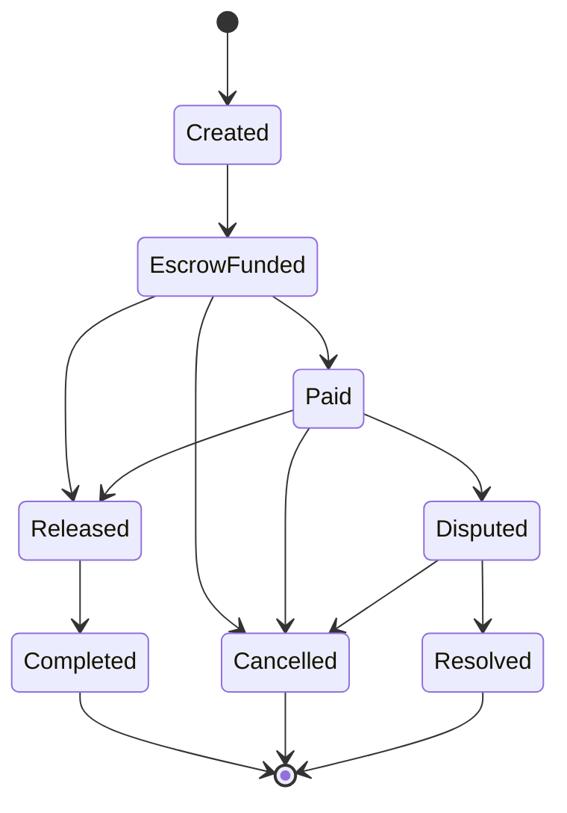

**Intended role guards:**

| Transition | Who should trigger |
|---|---|
| Created → EscrowFunded | System (custodial lock at trade creation) |
| EscrowFunded → Paid | Buyer or Admin |
| EscrowFunded → Released / Completed | Seller or Admin |
| Paid → Released / Completed | Seller or Admin |
| Paid → Disputed | Buyer or Seller |
| Any cancellable → Cancelled | Initiator or Admin |
| Created/EscrowFunded → Cancelled | Any participant (TF-005: within 10 min, counterparty unviewed) |
| Disputed → Resolved | Admin |
| Expired / Deadline → Cancelled | System (jobs) |

> **Design note — release is unilateral.** The seller's release does **not** depend on the buyer having marked the trade as paid. The buyer's `EscrowFunded → Paid` transition is informational — it signals to the seller that fiat is on the way — but it is **not** a precondition for release. The seller may release directly from `EscrowFunded → Released` at any time after escrow funds, accepting the risk of releasing before fiat lands. This is symmetric across sell-side and buy-side ads: the staker (seller in both directions — maker on sell-side ads, taker on buy-side ads) is the only party who controls release.

**Key fields:** `buyer_id`, `seller_id`, `offer_id`, `escrow_id`, `crypto_amount`, `fiat_amount`, `exchange_rate`, `fee_amount`, `time_limit_minutes`, `expires_at`
**Related entities:** TradeMessage, TradeEvent, TradeRating

---

### 1.2 Offer

**Model:** `Offer` (`models/offer.rs`)
**Status field:** `status: OfferStatus` (PostgreSQL enum `offer_status`)
**DB default:** `'active'`
**Terminal states:** Deleted (soft delete)
**Has `can_transition_to`?** Yes

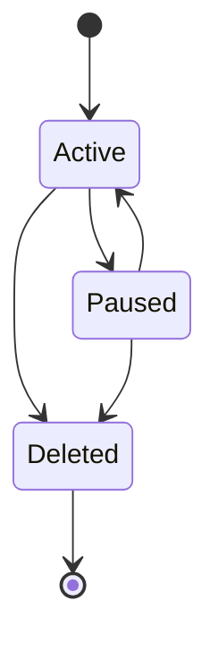

> **Design note:** The intended state machine has 3 states (Active, Paused, Deleted). `Closed` was not part of the original design — it was added later in the as-built implementation.

**Intended role guards:**

| Transition | Who should trigger |
|---|---|
| Active → Paused | Owner or Admin |
| Paused → Active | Owner or Admin |
| Active/Paused → Deleted | Owner or Admin |

**Key fields:** `user_id`, `offer_type` (Buy/Sell), `cryptocurrency`, `fiat_currency`, `pricing_mode` (Fixed/MarketPlusPremium), `escrow_type`, `payment_methods`, `min_amount`, `max_amount`
**Related entities:** OfferVersion (versioned edits)

---

### 1.3 Escrow

**Model:** `Escrow` (`models/escrow.rs`)
**Status field:** `status: EscrowStatus` (PostgreSQL enum `escrow_status`)
**DB default:** `'pending'`
**Terminal states:** Released, Refunded
**Has `can_transition_to`?** Yes

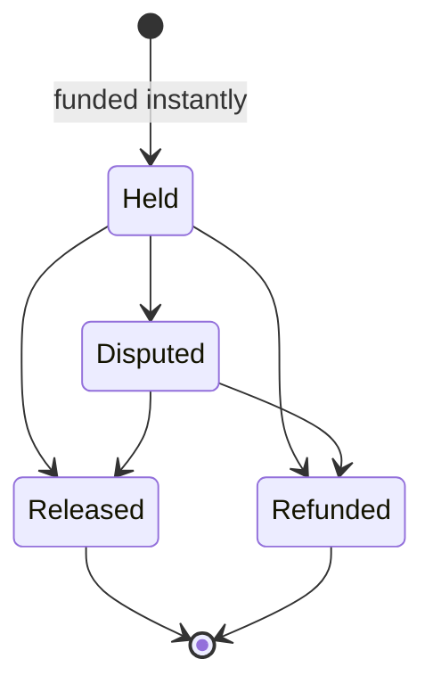

> **Design note:** The intended escrow flow starts at `Held` (funded instantly). The `Pending` and `AwaitingDeposit` states were not part of the original design — they were added in the as-built implementation to support non-custodial / on-chain escrow flows.

**Intended role guards:**

| Transition | Who should trigger |
|---|---|
| → Held | System (auto-funded at creation) |
| Held → Released | Seller or Admin |
| Held → Refunded | Buyer, Seller, or Admin |
| Held → Disputed | Buyer or Seller |
| Disputed → Released | Moderator (resolve to buyer) |
| Disputed → Refunded | Moderator (resolve to seller) |

**Key fields:** `trade_id`, `offer_id`, `buyer_id`, `seller_id`, `escrow_type` (Custodial/OnChain/OfferEscrow/BtcWalletLock), `cryptocurrency`, `amount`, `fee_amount`, `network`, `deposit_address`, `deposit_tx_hash`, `release_tx_hash`, `refund_tx_hash`
**Related entity:** EscrowWallet (per-escrow generated wallet)

---

## 2. User & Identity Domain

### 2.1 User

**Model:** `User` (`models/user.rs`)
**Stateful fields:**
- `role: Role` — User / Moderator / Admin / SuperAdmin (hierarchical, not a lifecycle)
- `kyc_status: KycStatus` — None / Pending / Approved / Rejected
- `is_verified: bool`
- `is_active: bool`
- `deleted_at: Option<DateTime>` (soft delete)

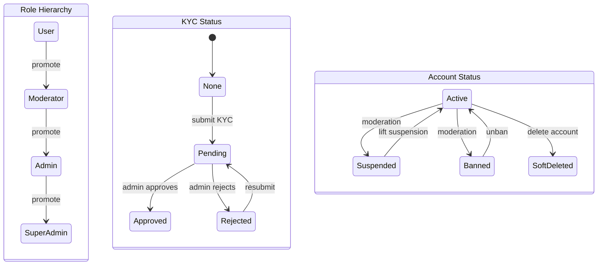

**Intended role guards:**

| Transition | Who should trigger |
|---|---|
| Role promotion | SuperAdmin (or Admin for lower tiers) |
| KYC submission | User (self) |
| KYC approval/rejection | Admin |
| KYC resubmission | User (after rejection) |
| Suspend / Ban | Moderator or Admin |
| Lift suspension / Unban | Moderator or Admin |
| Soft delete | Self or Admin |

> **Design note:** The intended design includes explicit `Suspended` and `Banned` account states with corresponding moderation actions. This requires dedicated boolean fields (e.g., `is_suspended`, `is_banned`) or a status enum on the User model.

**Related entities:** UserProfile, UserStats, UserSession, ActivityLogEntry, UserRating, UserBlock

---

### 2.2 KYC Submission

**Model:** `KycSubmission` (`models/kyc.rs`)
**Status field:** `status: KycStatus` (PostgreSQL enum `kyc_status`)
**DB default:** `'pending'`

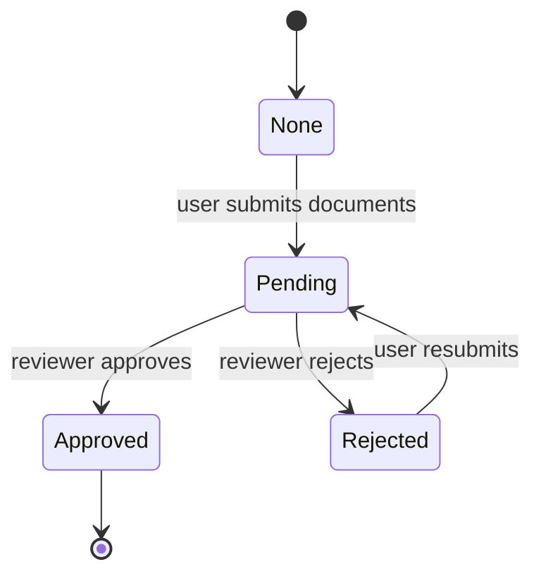

> **Design note:** The intended flow allows `Rejected → Pending` (resubmission). Users should be able to resubmit documents after rejection.

**Intended role guards:**

| Transition | Who should trigger |
|---|---|
| None → Pending | User (submits documents) |
| Pending → Approved | Admin (reviewer) |
| Pending → Rejected | Admin (reviewer) |
| Rejected → Pending | User (resubmits) |

**Key fields:** `user_id`, `level` (tiered KYC), `reviewer_id`, `rejection_reason`
**Related entity:** KycDocument (GovernmentId / Selfie / ProofOfAddress)
**Admin actions:** `KycReviewAction` — Approve / Reject / RequestReupload

---

## 3. Financial Domain

### 3.1 Wallet

**Model:** `Wallet` (`models/wallet.rs`)
**No lifecycle status enum** — balances are the state.
**Balance fields:**
- `balance` — available funds the user can spend
- `locked_balance` — funds frozen in an active trade escrow
- `pending_balance` — funds in an outbound on-chain withdrawal awaiting confirmation

**Constraints:** All balances >= 0

### 3.2 WalletTransaction

> **⚠ FLAG:** `status` is a free-text `TEXT` column — not a PostgreSQL enum. There is no database-level enforcement of valid states, meaning any arbitrary string can be written. This is a data integrity risk: invalid states can slip through undetected, and querying/filtering by status is fragile. **Recommend migrating to a proper PG enum.**

**Model:** `WalletTransaction` (`models/wallet.rs`)
**Status field:** `status: String` (TEXT, DB default `'pending'`)
**Intended states:** pending → confirmed / failed

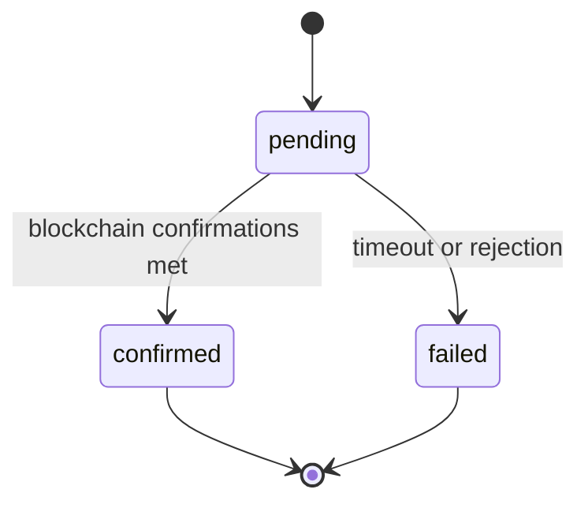

**Key fields:** `tx_type` (string — deposit/withdrawal/etc), `tx_hash`, `confirmations`, `network`

### 3.3 WalletLock

**Model:** `WalletLock` (`models/wallet.rs`)
**Implicit lifecycle:** Locked (created, `released_at` is NULL) → Released (`released_at` is set)

A lock is created when a **trade is initiated** against an offer — the seller's funds are held until the trade completes or is cancelled. Locks are per-trade, not per-offer.

### 3.4 LedgerEntry

**Model:** `LedgerEntry` (`models/ledger.rs`)
**No lifecycle** — immutable append-only records.
**Type field:** `entry_type: LedgerEntryType` — TradeCredit / TradeDebit / EscrowLock / EscrowRelease / Withdrawal / Deposit / Fee / Refund
**Direction field:** `direction: LedgerDirection` — Credit / Debit

### 3.5 TreasuryTransaction

> **⚠ FLAG:** Same issue as 3.2 — `status` is a free-text `TEXT` column with no enum enforcement. Platform treasury operations are high-sensitivity; invalid or inconsistent status values here are a financial risk. **Recommend migrating to a proper PG enum.**

**Model:** `TreasuryTransaction` (`models/ledger.rs`)
**Status field:** `status: String` (TEXT) — platform treasury ops
**Intended states:** pending → confirmed / failed

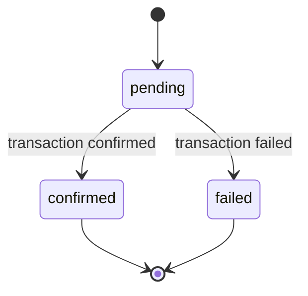

### 3.6 Fee Model

> **Purpose:** Defines how platform fees are calculated, who pays, when they're collected, and where they go. This is the authoritative reference for fee behaviour across regular and reseller trades.

#### 3.6.1 Regular Trade Fees (Escrow Fee)

**Who pays:** Whoever stakes the crypto in escrow.
- **SELL offer:** The maker (seller) puts crypto in escrow → maker pays the escrow fee.
- **BUY offer:** The taker (seller of crypto) puts crypto in escrow → taker pays the escrow fee.

**Rate:** 0.7% (70 bps) of the **crypto amount** locked in escrow.
**Config:** `platform_fee_bps` — runtime-configurable via admin dashboard (`/admin/config`), default 70 bps.

**Flow:**

1. Buyer clicks buy for R100. The quote engine converts R100 → crypto using the seller's marked-up exchange rate (e.g. R18.50/USDT → 5.40540540 USDT).
2. The crypto staker's wallet is debited for `crypto_amount + 0.7% escrow fee` and locked in escrow. The fiat party pays out-of-band (bank transfer, etc.).
3. On trade completion (crypto staker releases — the buyer's `mark-paid` is informational, not a gate; the staker may release directly from `EscrowFunded`):
   - **Buyer receives:** `crypto_amount` (the full crypto value)
   - **Platform receives:** `0.7% escrow fee` (credited to platform treasury via ledger)
   - **Fiat party keeps:** the fiat (their markup profit is baked into the exchange rate)

**Worked example (R100, USDT at R18.50, 0% markup):**

| Step | Amount | Description |
|---|---|---|
| Buyer spends | R100.00 fiat | Paid to seller out-of-band |
| Quote | 5.40540540 USDT | R100 / R18.50 |
| Escrow fee | 0.03783783 USDT | 0.7% of 5.40540540 |
| Escrow locks | 5.44324323 USDT | crypto + fee, from crypto staker's wallet |
| Buyer receives | 5.40540540 USDT | On completion |
| Platform receives | 0.03783783 USDT | Fee → treasury ledger |

**Conservation law:** `buyer_receives + platform_fee == escrow_amount`

#### 3.6.2 Reseller Trade Fees

Reseller trades carry **the same 0.7% escrow fee as regular trades**, paid by whoever stakes the crypto, **plus** a **25% platform fee** taken from the reseller's profit. The two fees stack — they are independent and serve different purposes:

- The **escrow fee** compensates the platform for custody and infrastructure. It applies to every trade, regular or resell, and is owed by whichever party puts crypto into escrow.
- The **reseller platform fee** is the platform's cut of the reseller's middleman markup. It only exists when there's a resell markup to take a cut from.

| Fee | Rate | Applied to | Who pays | Purpose |
|---|---|---|---|---|
| **Escrow fee** | 0.7% (70 bps) | Crypto staked in escrow | Crypto staker (vendor on Sell-side resells, taker on Buy-side resells) | Custody / infrastructure — same rule as regular trades |
| **Reseller platform fee** | 25% (2500 bps) | Reseller's gross markup commission | Reseller (deducted from their commission at settlement) | Platform's cut of the reseller's middleman profit |

**Who stakes crypto on each side:**
- **Sell-side resell** (vendor's offer is a Sell offer — vendor sells crypto): vendor stakes the crypto and pays the 0.7% escrow fee.
- **Buy-side resell** (vendor's offer is a Buy offer — vendor buys crypto, taker sells): the taker stakes the crypto and pays the 0.7% escrow fee.

The reseller never stakes anything — they're a middleman, not a counterparty. They never pay the escrow fee. They do pay the 25% reseller platform fee on whichever side they stand, taken out of their commission at settlement.

**Config (runtime-configurable via admin dashboard `/admin/config`):**
- `platform_fee_bps` (default: 70 / 0.7%) — escrow fee on the crypto staker, applies to **both regular and resell trades**
- `reseller_escrow_fee_bps` (default: 0 / 0%) — additional fee on the reseller commission itself; off by default
- `reseller_fee_bps` (default: 2500 / 25%) — platform cut of reseller's markup commission

> **Note on `vendor_resell_fee_bps`:** historically a separate knob that suppressed the escrow fee on resell trades (defaulted 0). Per this design intent it is deprecated — resell trades should use the same `platform_fee_bps` rule as regular trades. The knob remains in config for backwards-compatible rollout but should be set equal to `platform_fee_bps` (or removed) once all in-flight resell trades have settled.

> **Affiliate commission accrues on the 0.7% vendor escrow fee on every trade, including resell trades.** The platform's 25% cut of the reseller's markup commission is platform revenue and is **not** part of the affiliate commission base — affiliates only ever share in the vendor escrow fee. Enforced by `ReleaseResult::affiliate_commission_base()` in `services::escrow_release.rs`, which extracts `SettlementAmounts.vendor_fee` on resell trades and returns `fee_collected` (= vendor fee) on regular trades. The POST `/complete` handler (`api::trades`) passes that value as `fee_amount` to `services::affiliate_commission::record_commissions`. The PATCH `/complete` handler reads `escrow.fee_amount` directly, which already holds the vendor-fee component only.

**How markups stack:**

The buyer sees the resell offer on the marketplace like any other offer. The price reflects **both** markups stacked: the vendor's markup on market rate, plus the reseller's markup on top. The buyer doesn't know or care that it's a resell offer — they just see a single exchange rate.

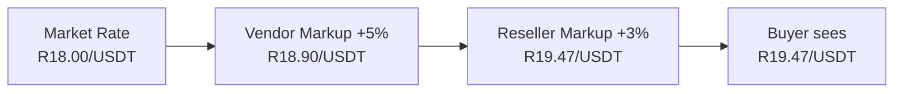

**Flow (Sell-side resell — most common case):**

1. Vendor creates a Sell offer at their desired markup above market rate.
2. Reseller creates a resell offer with X% markup **on top of** the vendor's rate. The resell offer appears on the marketplace like any other offer.
3. Buyer clicks buy for R100. The quote engine converts R100 → crypto at the combined marked-up rate. The buyer receives less crypto than market rate because both markups are baked into the exchange rate.
4. The **vendor's** wallet is debited for `crypto_amount + 0.7% escrow fee` and locked in escrow. The reseller does not fund anything.
5. On trade completion (seller releases — typically after the buyer confirms fiat sent, but not gated on it; the seller may release from `EscrowFunded` directly), atomic 3-way split:
   - **Buyer receives:** `crypto_amount - reseller_gross_commission` (the crypto value at the combined markup rate)
   - **Reseller receives:** `reseller_gross_commission - 25% reseller platform fee`
   - **Platform receives:** `0.7% escrow fee + 25% of reseller's gross commission`

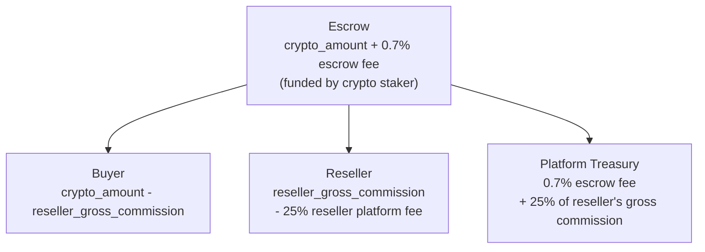

**Worked example (100 USDT trade, 5% reseller markup, Sell-side resell):**

| Component | Amount | Calculation |
|---|---|---|
| Escrow amount (crypto for buyer) | 100.00 USDT | trade size at combined rate |
| Escrow fee (paid by vendor) | 0.70 USDT | 0.7% of 100 |
| **Vendor stakes (debited)** | **100.70 USDT** | crypto + escrow fee |
| Reseller gross commission | 5.00 USDT | 5% of 100 |
| Reseller platform fee | 1.25 USDT | 25% of 5.00 |
| **Buyer receives** | **95.00 USDT** | 100 − reseller_gross_commission |
| **Reseller receives** | **3.75 USDT** | 5.00 − 1.25 platform fee |
| **Platform receives** | **1.95 USDT** | 0.70 escrow fee + 1.25 reseller fee |

**Conservation law:** `buyer_amount + reseller_net + platform_total == vendor_staked`
`95.00 + 3.75 + 1.95 = 100.70` ✓

For a Buy-side resell, the table reads the same except step 4 reverses: the **taker** is the crypto staker and pays the 0.7% escrow fee; the vendor sends fiat off-platform.

#### 3.6.3 Fee Collection Lifecycle

**Regular trades (2-way split):**

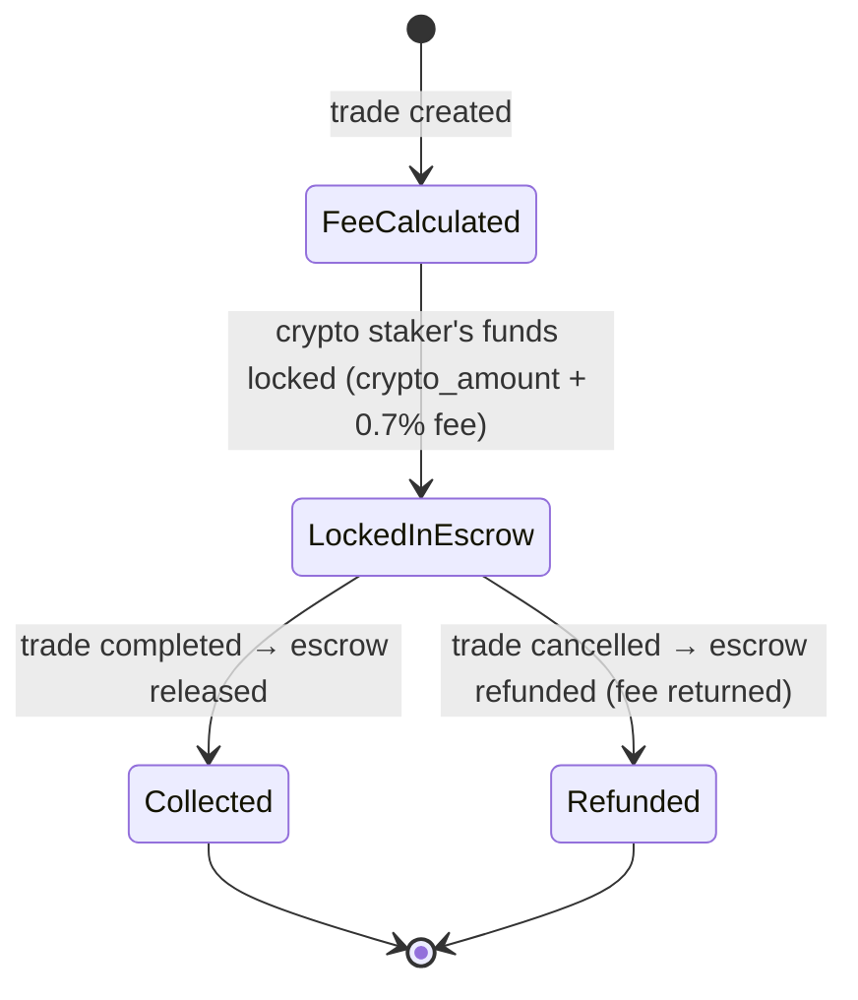

**Reseller trades (3-way split with escrow fee):**

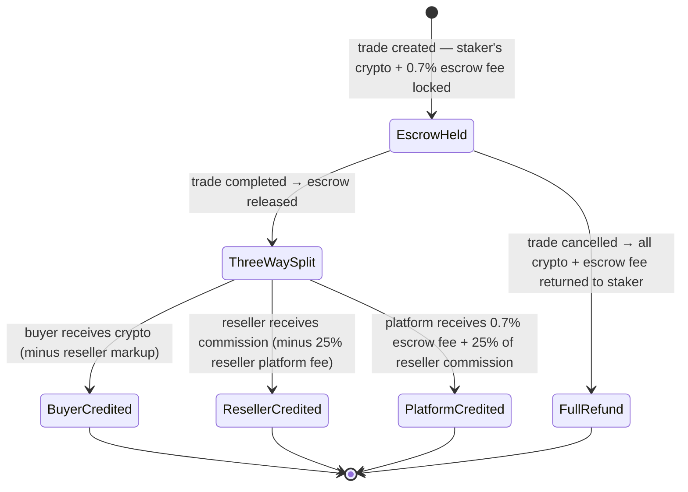

- **Calculated at:** Trade creation (`services/platform_fee::vendor_fee()` for escrow fee, applied to staker; reseller platform fee calculated at escrow release from gross commission)
- **Stored on:** `escrow.fee_amount` (escrow fee in crypto minor units — non-zero for resell trades under this design intent)
- **Collected at:** Escrow release (trade completion). Two ledger entries on resell completion: one for the 0.7% escrow fee, one for the 25% reseller platform fee.
- **Recorded as:** `LedgerEntryType::Fee` entries credited to platform account (`Uuid::nil()`)
- **On cancellation:** All crypto **and the escrow fee** are refunded to the staker — platform collects nothing, reseller receives nothing

#### 3.6.4 Configuration

| Parameter | DB key | Env var fallback | Default | Description |
|---|---|---|---|---|
| `platform_fee_bps` | `platform_fee_bps` | `PLATFORM_FEE_BPS` | 70 (0.7%) | Escrow fee — paid by whoever stakes crypto. Applies to **both regular and resell trades**. |
| `vendor_resell_fee_bps` | `vendor_resell_fee_bps` | `VENDOR_RESELL_FEE_BPS` | 70 (0.7%) | **Deprecated** — should equal `platform_fee_bps`. Resell trades use the same escrow fee rule as regular trades. Will be removed once all in-flight trades have settled. |
| `taker_fee_bps` | `taker_fee_bps` | `TAKER_FEE_BPS` | 0 (0%) | Buyer fee (unused) |
| `reseller_escrow_fee_bps` | `reseller_escrow_fee_bps` | `RESELLER_ESCROW_FEE_BPS` | 0 (0%) | Optional additional fee on the reseller commission itself; off by default |
| `reseller_fee_bps` | `reseller_fee_bps` | `RESELLER_FEE_BPS` | 2500 (25%) | Platform cut of reseller's markup commission |

> **Architecture:** All fees are runtime-configurable via the admin dashboard (`/admin/config`). Values are stored in the `platform_config` DB table and loaded into `FeeConfig` atomics at startup. Admin updates take effect immediately (no restart required). Env vars serve as initial defaults if no DB entry exists.
>
> **Affiliate commission base = the vendor escrow fee actually collected.** `record_commissions` receives `fee_amount` from its caller and applies the per-tier basis points to it. On regular trades the caller passes `escrow.fee_amount` (= `platform_fee_bps` of crypto amount). On resell trades the caller passes `SettlementAmounts.vendor_fee` (same vendor-fee component, excluding the 25% reseller cut). Changing `platform_fee_bps` in admin therefore moves the affiliate base directly — there is no decoupled hardcoded rate. The leftover `AffiliateTier::ESCROW_FEE_BPS = 25` constant in `types/enums.rs` is **dead code**, never read from the live commission flow, and should be removed.

> **Implementation note:** Fee calculation uses ceiling division (rounds up) so the platform never under-collects. All arithmetic uses `i64` minor units (satoshis, sun, etc.) with `i128` intermediates to avoid precision loss on 18-decimal cryptos. If the platform fee exceeds the reseller's gross commission, the settlement returns `None` and falls back to a standard 2-way split.

**Key files:**
- `services/platform_fee.rs` — pure fee calculation functions (no hardcoded constants — all rates passed as parameters)
- `services/escrow_release.rs` — fee collection and 3-way settlement (`compute_reseller_settlement`)
- `services/ledger.rs` — fee recording (`record_platform_fee`, `record_reseller_escrow_fee`, `record_reseller_platform_fee`)
- `config.rs` — `FeeConfig` struct with `AtomicU32` fields for hot-reloadable fee rates

#### 3.6.5 Withdrawal Gas Fees (GAP-005 / GAP-007)

> **Purpose:** Defines how gas fees are handled for off-platform withdrawals. The platform sponsors gas for token withdrawals and charges a fixed fee on top of the withdrawal amount. The fee is admin-configurable via `platform_config` and uses two tiers for USDT on Tron (existing wallet vs new wallet).

**Withdrawal flow (end-to-end):**

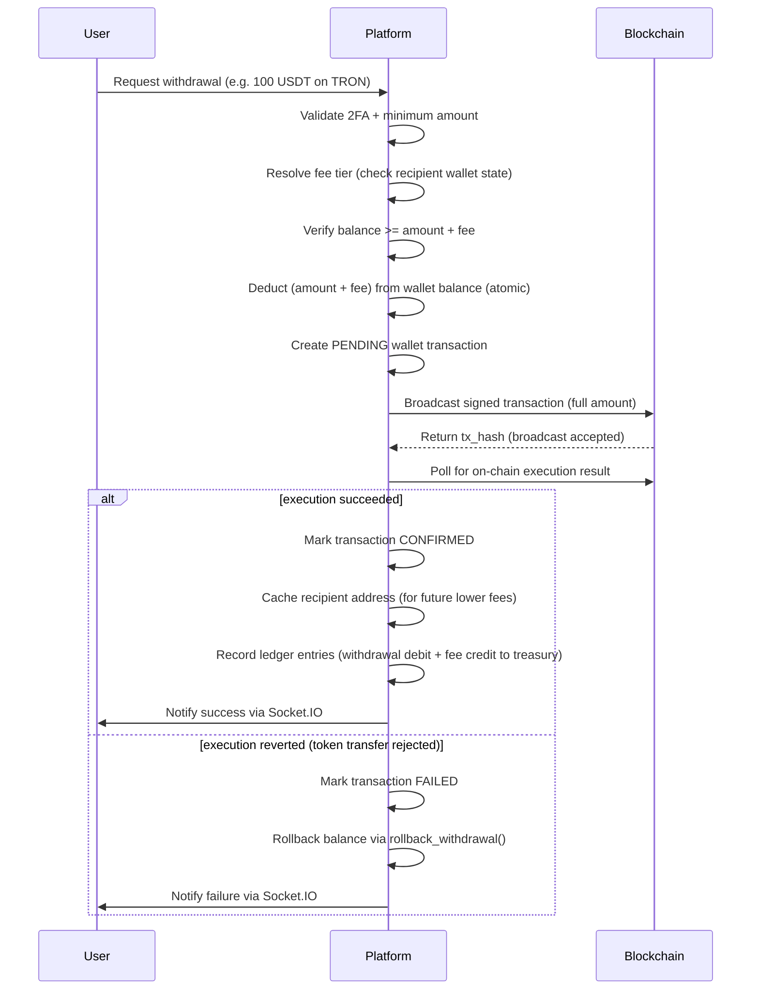

**Deduction model:** Fee is charged **on top** of the withdrawal amount — not deducted from it. User enters an amount, the platform deducts `amount + fee` from their wallet, and the user receives the **full amount** on-chain.

Example: User withdraws 100 USDT with a 1.90 fee → wallet debited 101.90, user receives 100.00 USDT on-chain. Fee credited to treasury via ledger entry.

**Gas fee model by withdrawal type:**

| Type | Examples | Who pays gas | How |
|---|---|---|---|
| **Native coin** | SOL, TRX, ETH, BTC | User directly | Network deducts gas from amount on-chain |
| **Token (sponsored)** | USDT/USDC on TRON/ETH | Platform sponsors upfront | Treasury wallet pays gas in native coin (TRX/ETH), fixed fee charged to user on top of withdrawal amount |

**Two-tier fee model (USDT on Tron):**

Tron charges 2x energy (130,000 vs 65,000 units) when the recipient address has never held USDT before. The platform checks the recipient's wallet state and charges accordingly:

| Recipient wallet state | Tron energy cost | Fee charged |
|---|---|---|
| Already holds USDT (cached or confirmed via RPC) | ~65,000 energy (~$1.87) | **$1.90 USDT** |
| Never held USDT / new address / RPC unavailable | ~130,000 energy (~$3.74) | **$3.90 USDT** |

**Fee resolution order:**
1. Check `known_usdt_addresses` cache table (fast DB lookup)
2. Call Tron RPC `fetch_trc20_balance` on the recipient address (with one retry)
3. Fallback to higher-tier fee (`fee_new_wallet`) if both fail

After a successful withdrawal, the recipient address is cached in `known_usdt_addresses` so future withdrawals to the same address get the lower fee.

**Fee configuration:** Stored in `platform_config` table under key `withdrawal_fees` as JSON. Admin-editable via `/admin/withdrawal-fees` dashboard.

```json
{
  "USDT": { "fee": 1.90, "fee_new_wallet": 3.90, "currency": "USDT", "network": "TRON (TRC-20)" },
  "BTC":  { "fee": 0.0002, "fee_new_wallet": 0.0002, "currency": "BTC", "network": "Bitcoin" }
}
```

For currencies where two-tier fees don't apply (BTC, ETH, SOL, USDC), `fee` and `fee_new_wallet` are set to the same value.

**Minimum withdrawal amounts:**

| Currency | Minimum |
|---|---|
| USDT / USDC | 5.00 |
| BTC | 0.0001 |
| ETH | 0.001 |
| SOL | 0.01 |
| TRX | 1.0 |

**Supported networks and currencies:**

| Network | Native | Tokens |
|---|---|---|
| Solana | SOL | USDC (SPL) |
| TRON | TRX | USDT (TRC-20) |
| Ethereum | ETH | USDT (ERC-20), USDC (ERC-20) |
| Bitcoin | BTC | — |

**Safety and error handling:**

- Balance deduction + PENDING transaction created in a single DB transaction (crash-safe)
- If broadcast fails (node rejects) → balance rolled back via `rollback_withdrawal()`, transaction marked FAILED
- If broadcast succeeds but on-chain execution reverts → balance rolled back via `rollback_withdrawal()`, transaction marked FAILED. This can happen on token withdrawals (TRC-20, ERC-20, SPL) when the sending wallet has insufficient token balance — the network accepts the transaction but the token contract rejects the transfer. Native coin sends (TRX, ETH, SOL, BTC) cannot revert post-broadcast.
- After broadcast, the platform must poll the network for the execution result before marking CONFIRMED. A successful broadcast only means the transaction was accepted into the mempool — it does not guarantee execution.
- If ledger entry fails after successful on-chain send → written to `failed_ledger_entries` for admin reconciliation
- Fee resolution errors propagate at withdrawal execution time (not silently swallowed)
- Fee estimation endpoints (used for UI display) gracefully fall back to the higher tier on error
- 2FA required for all withdrawals

**Key files:**
- `src/api/wallet.rs` — main withdrawal handler
- `src/api/gas.rs` — fee tier resolution (`resolve_withdrawal_fee_for_recipient`), sponsored withdrawal estimation and execution
- `src/services/blockchain/` — network-specific signing and broadcasting (solana.rs, tron.rs, ethereum.rs, bitcoin.rs)

---

## 4. Support & Moderation Domain

### 4.1 SupportTicket

**Model:** `SupportTicket` (`models/support.rs`)
**Status field:** `status: TicketStatus` (PostgreSQL enum `ticket_status`)
**DB default:** `'open'`

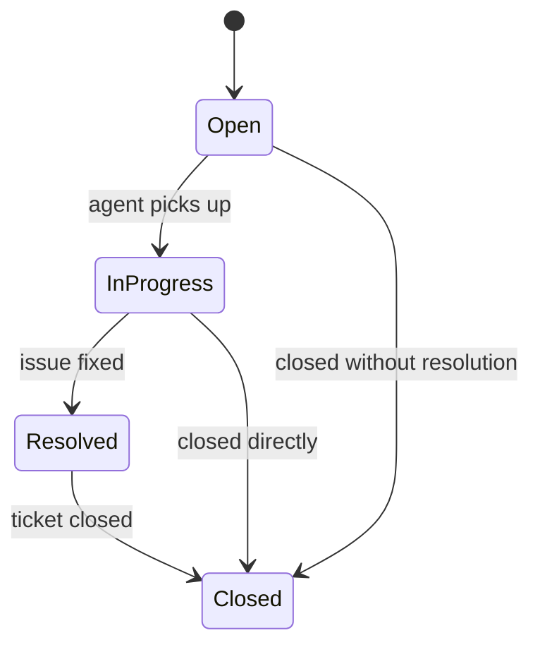

**Intended role guards:**

| Transition | Who should trigger |
|---|---|
| Open → InProgress | Support agent (moderator) |
| InProgress → Resolved | Support agent (moderator) |
| Resolved → Closed | Owner or Admin |
| Open/InProgress → Closed | Owner or Admin |

**Related entity:** TicketMessage

---

### 4.2 Dispute

**Model:** `Dispute` (`models/moderation.rs`)
**Status field:** `status: String` (TEXT, DB default `'open'`)
**Priority field:** `priority: DisputePriority` — Low / Medium / High / Urgent / Critical
**Intended states:** open → under_review → resolved / closed

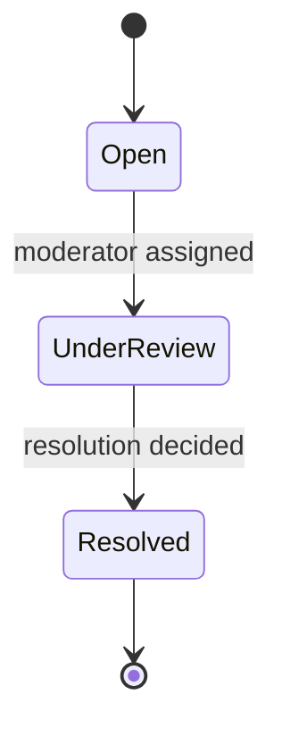

**Intended role guards:**

| Transition | Who should trigger |
|---|---|
| Open → UnderReview | Moderator (assignment) |
| UnderReview → Resolved | Moderator or Admin |

**Key fields:** `trade_id`, `escrow_id`, `initiator_id`, `respondent_id`, `assigned_to`, `resolved_by`, `resolved_against_user_id`, `response_deadline`, `escalation_deadline`
**Related entities:** DisputeMessage, DisputeEvidence

---

### 4.3 BugReport

**Model:** `BugReport` (`models/bug_report.rs`)
**Status field:** `status: BugStatus` (PostgreSQL enum `bug_status`)
**DB default:** `'new'`
**Severity field:** `severity: BugSeverity` — Critical / High / Medium / Low
**Category field:** `category: BugCategory` — Frontend / Backend / Wallet / Trading / Escrow / Authentication / Other

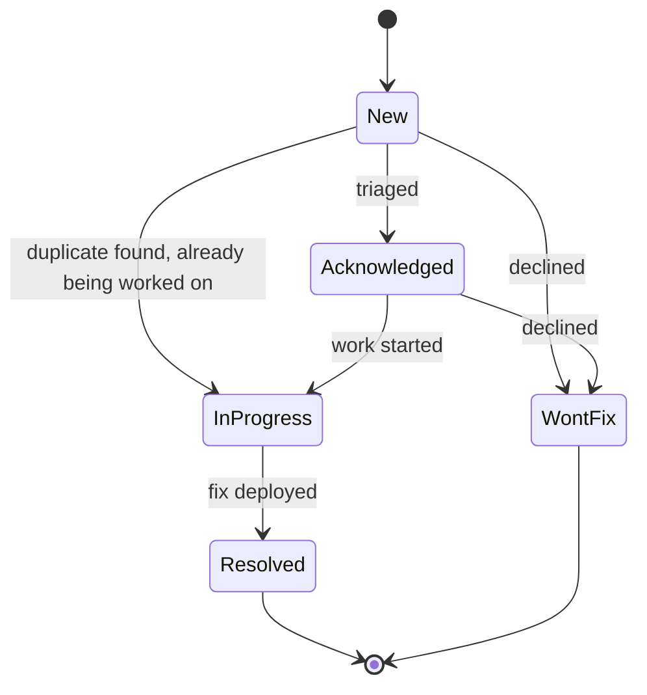

> **Design note:** The intended state machine has 5 states and enforces a directed flow. `Duplicate` was not part of the original design — it was added in the as-built implementation as a 6th `BugStatus` variant. A `can_transition_to` guard should be implemented to prevent arbitrary status jumps.

**Intended role guards:**

| Transition | Who should trigger |
|---|---|
| New → Acknowledged | Moderator (triage) |
| New/Acknowledged → InProgress | Moderator |
| New/Acknowledged → WontFix | Moderator |
| InProgress → Resolved | Moderator |

---

### 4.4 Report

**Model:** `Report` (`models/support.rs`)
**Status field:** `status: String` (TEXT)
**Intended states:** open → reviewed → resolved

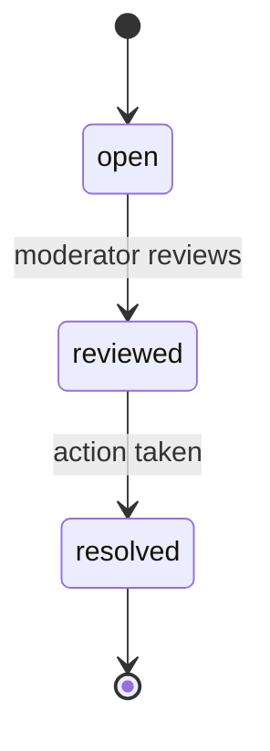

### 4.5 Moderation Actions (Event Log)

**Model:** `ModerationLog` (`models/moderation.rs`)
**Action field:** `action: ModerationAction` — Warn / Suspend / Ban / Unban / LiftSuspension
**No lifecycle** — each entry is an immutable event. The effect is reflected on the User entity.

---

## 5. Affiliate & Reseller Domain

### 5.1 AffiliateProfile

**Model:** `AffiliateProfile` (`models/affiliate.rs`)
**Tier field:** `tier: AffiliateTier` — Novice / Bronze / Silver / Gold / Diamond (progression)

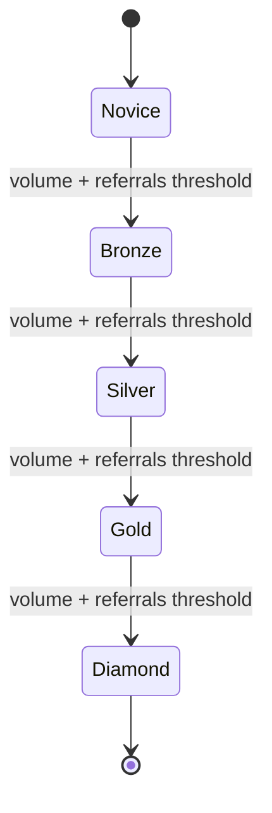

Tier progression is **one-directional** — promotions only, never demotions. `services::affiliate_tier::check_and_promote` is invoked after trade completion (volume may have changed) and after a new referral signup (affiliate count may have changed). Both conditions (cumulative trading volume **and** direct affiliate count) must clear the tier's thresholds for promotion.

**Tier configuration (`TIER_CONFIGS` in `types/enums.rs`):**

| Tier | Min volume (cents) | Min affiliates | Max affiliates | A1 bps | A2 bps | A3 bps |
|---|---|---|---|---|---|---|
| Novice  | 1,000      | 0   | 4   | 500  (5%)  | 0          | 0         |
| Bronze  | 5,000      | 5   | 10  | 1000 (10%) | 400 (4%)   | 0         |
| Silver  | 800,000    | 10  | 50  | 1500 (15%) | 800 (8%)   | 300 (3%)  |
| Gold    | 5,000,000  | 50  | 100 | 2000 (20%) | 1000 (10%) | 500 (5%)  |
| Diamond | 30,000,000 | 100 | 200 | 2500 (25%) | 1200 (12%) | 700 (7%)  |

Bps = basis points of the **vendor escrow fee** (see Section 3.6.4). A1 / A2 / A3 are the direct, indirect, and grand-indirect referral levels respectively. Min volume thresholds are stored as cents and exposed to the frontend in dollars via `GET /affiliate/tiers`.

### 5.2 Referral

**Model:** `Referral` (`models/affiliate.rs`)
**Status field:** `status: String`
**Intended states:** pending → active

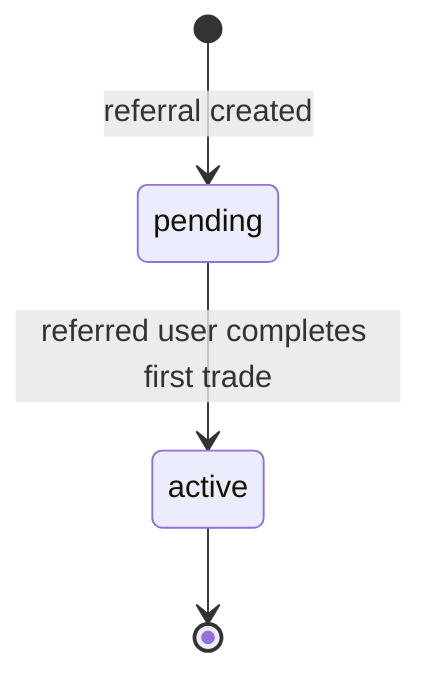

### 5.3 AffiliatePayout

**Model:** `AffiliatePayout` (`models/affiliate.rs`)
**Status field:** `status: String`
**Intended states:** requested → completed

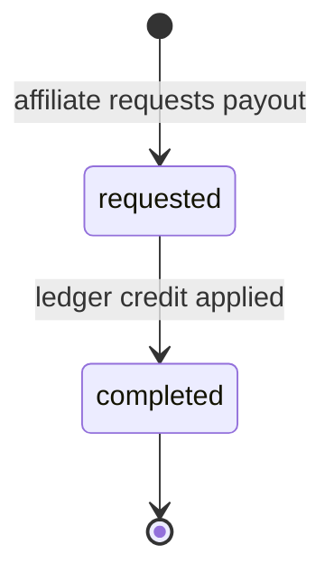

Payouts credit the affiliate's Qic wallet balance via a ledger entry — no on-chain transfer involved. The operation either succeeds or rolls back within a single DB transaction, so `processing` and `failed` states are unnecessary.

### 5.4 ResellOffer

**Model:** `ResellOffer` (`models/affiliate.rs`)
**Status field:** `status: String`
**Intended states:** active / paused / closed

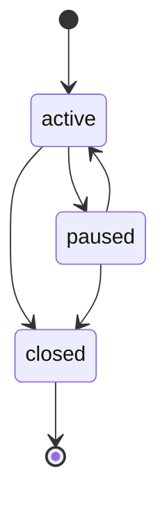

#### 5.4.1 Inheritance from the parent offer

A resell offer is a new `offers` row with `parent_offer_id` set, created in `api::reseller::create_resell_v2`. It inherits most fields verbatim and applies the reseller's markup only to the **rate**, not to the **fiat min/max**:

| Field | Rule on resell creation |
|---|---|
| `fixed_price` | `parent.fixed_price × markup_factor` (factor = `1 + m/100` for sell, `1 − m/100` for buy) |
| `premium_percentage` | `parent.premium_percentage ± markup_pct` (signed by side) |
| `min_amount` / `max_amount` | **Inherited from parent unchanged** on both sell and buy resells |
| Everything else (currency, payment methods, escrow type, terms, etc.) | Verbatim copy |

**Why fiat limits are not scaled.** The vendor's `min_amount` / `max_amount` describe the bank transfer they accept. A bank transfer is a single fiat amount per trade, and that amount doesn't change when a reseller sits in the middle — what changes is how much crypto the staker stakes vs how much crypto the buyer receives. The reseller's gross commission is the crypto-side spread, not a fiat-side adjustment, and is settled by `services::escrow_release::compute_reseller_settlement`.

Scaling either side breaches the vendor's stated bounds:
- **Buy resell at scaled (1 − m%) min:** the vendor receives less fiat than their stated minimum. At `R 450` on a `R 500` parent (10% margin), the vendor sees `R 450` fiat and `24.32 USDT` delivered — both below their stated `R 500` / `27.03 USDT` minimum.
- **Sell resell at scaled (1 + m%) max:** the vendor receives more fiat than their stated max and is forced to stake more crypto than they agreed to. At `R 5,500` on a `R 5,000` parent (10% markup), the vendor handles `R 5,500` and stakes `305.56 USDT` (vs intended `R 5,000` / `277.78 USDT`). If the vendor's wallet was sized to their stated max, the lock fails outright.

The "scaling preserves the buyer's crypto cap" argument that originally motivated sell-side scaling is misleading: once a reseller is in the middle, the buyer is on a worse rate and should not expect identical crypto delivery to the parent offer.

### 5.5 Affiliate Commission Recording

**Service:** `services::affiliate_commission::record_commissions`

**Base.** A share of the **vendor escrow fee** collected on the trade — `platform_fee_bps` of the staker's contribution (default 0.7%, runtime-configurable). This applies to both regular trades and resell trades; on resell trades the caller pre-strips the platform's 25% cut of the reseller's markup so it never enters the affiliate base. See `ReleaseResult::affiliate_commission_base()` in `services::escrow_release`.

**Levels.** Up to A1 (direct referrer), A2, and A3 are resolved by walking the `users.referred_by` chain from each participant up to three hops. Tier-specific basis points (`a1_bps`, `a2_bps`, `a3_bps` in `TIER_CONFIGS`) are applied to the base.

**Both chains.** The buyer's chain and the seller's chain are both traversed. A referrer who appears in both chains is paid only once at the lowest (best) level — deduplication is enforced via a `HashSet<Uuid>` keyed on `referrer_id`.

**Self-referral guard.** `buyer_id` and `seller_id` are pre-inserted into the dedup set so they can never earn commission on their own trade — even if they referred someone elsewhere in the chain.

**Idempotency.** Before any commission rows are written, `SELECT COUNT(*) FROM affiliate_earnings WHERE trade_id = $1` short-circuits if commissions for the trade already exist. Both the POST `/complete` and PATCH `/complete` paths fire `record_commissions` and the guard ensures only one wins.

**Profile auto-creation.** `ensure_affiliate_profile` creates an `affiliate_profiles` row on first commission for any referrer who never visited the affiliate dashboard. Without this, commissions silently dropped for new referrers — that bug class is closed by upserting on `(user_id)` and returning the profile id.

**Atomicity.** Every per-referrer payout is wrapped in a single DB transaction:
1. Insert `affiliate_earnings` row.
2. Update referrer's `pending_earnings` and `total_earnings` on `affiliate_profiles`.
3. Read back `pending_earnings` for the ledger `balance_after`.
4. Credit the referrer in the ledger (`LedgerEntryType::AffiliateCommission`).
5. Debit the platform user (`Uuid::nil()`) in the ledger so the books balance — the platform's net take per trade is `fee_collected − sum(affiliate_payouts)`.

```mermaid
flowchart TD
    Trade[Trade reaches Completed]
    Base[Compute commission base<br/>= vendor escrow fee]
    Trade --> Base
    Base --> Idem{affiliate_earnings<br/>already exist for trade?}
    Idem -->|yes| Skip[Skip — idempotent]
    Idem -->|no| Chains[Walk buyer chain + seller chain<br/>up to 3 hops each]
    Chains --> Dedup[Dedup referrers<br/>exclude buyer + seller]
    Dedup --> Loop[For each referrer]
    Loop --> Tx[BEGIN tx]
    Tx --> Earn[INSERT affiliate_earnings]
    Earn --> Prof[UPDATE affiliate_profiles<br/>pending + total]
    Prof --> Cred[Ledger CREDIT referrer<br/>AffiliateCommission]
    Cred --> Debt[Ledger DEBIT platform Uuid::nil<br/>Fee/Debit]
    Debt --> Commit[COMMIT]
    Commit --> Loop
```

### 5.6 Reseller & Affiliate Interaction

Resell trades introduce a third counterparty — the **reseller** — who places a marked-up copy of a vendor's offer. Three platform takings occur on settlement (see Section 3.6.4 for the full breakdown):

1. **Vendor escrow fee** — `platform_fee_bps` of the staker's contribution. Default 0.7%. Same rule as a regular trade.
2. **Reseller escrow fee** — `reseller_escrow_fee_bps` of the reseller's gross commission. Default 0%.
3. **Reseller platform fee** — `reseller_fee_bps` of the reseller's gross commission. Default 25%. This is the platform's cut of the reseller's middleman markup.

**Affiliate base on resell trades = vendor escrow fee only.** Items 2 and 3 above are platform revenue and are **not** shared with any referral chain. The reseller's net profit (gross commission − items 2 − 3) is also outside the affiliate base — it is paid to the reseller, not to the platform.

This is enforced structurally:
- `SettlementAmounts` (`services::escrow_release.rs`) splits the three takings into named fields: `vendor_fee`, `reseller_escrow_fee`, `reseller_platform_fee`.
- `ReleaseResult::affiliate_commission_base()` returns `vendor_fee` when a settlement is present and `fee_collected` otherwise — the only value that ever reaches `record_commissions` as `fee_amount`.

The `is_resell` parameter on `record_commissions` is **not** load-bearing for branching — it is retained only for tracing. The function treats resell and non-resell trades identically; the divergence happens upstream in the caller's choice of `fee_amount`.

---

## 6. Notification & Preference Domain

### 6.1 Notification

**Model:** `Notification` (`models/notification.rs`)
**Type field:** `notification_type: NotificationType` — Trade / Message / Offer / Escrow / Affiliate / Wallet / Payment / System
**Read state:** `is_read: bool` (Unread → Read)

### 6.2 NotificationPreference

**Model:** `NotificationPreference` (`models/notification_preference.rs`)
**Toggle:** `enabled: bool` per `category: NotificationType`

---

## 7. Audit & Configuration (Stateless / Append-Only)

| Entity | Model | Notes |
|---|---|---|
| AuditEntry | `models/moderation.rs` | Immutable event log |
| ActivityLogEntry | `models/user.rs` | Immutable user activity log |
| TradeEvent | `models/trade.rs` | Immutable trade event stream |
| GuestContactRequest | `models/support.rs` | Inbound form, no lifecycle |
| Feedback | `models/support.rs` | Complaint/Compliment/Suggestion, no lifecycle |
| PaymentMethod | `models/ledger.rs` | CRUD, no status |
| DepositAddress | `models/wallet.rs` | Generated once, no lifecycle |
| CustodialWallet | `models/wallet.rs` | Per-user per-network, no lifecycle |
| PriceAlert | `models/price_alert.rs` | `triggered_at` acts as implicit boolean state |

---

## Summary: Entities with Explicit State Machines

| Entity | Status Enum | States | Terminal States | Has `can_transition_to`? | All transitions wired in API? |
|---|---|---|---|---|---|
| **Trade** | `TradeStatus` | 8 | Completed, Cancelled, Resolved | Yes | Yes |
| **Offer** | `OfferStatus` | 3 | Deleted | Yes | Yes |
| **Escrow** | `EscrowStatus` | 4 | Released, Refunded | Yes | Yes |
| **KycSubmission** | `KycStatus` | 4 | Approved (soft terminal) | No — should be added | Partial — needs Rejected→Pending |
| **SupportTicket** | `TicketStatus` | 4 | Closed | No — should be added | No — needs InProgress, Resolved |
| **BugReport** | `BugStatus` | 5 | Resolved, WontFix | No — should be added | Yes (but needs transition guards) |
| **AffiliateProfile** | `AffiliateTier` | 5 | Diamond (ceiling) | No (linear progression) | Needs promotion endpoint |

## Summary: Entities with Soft/Convention-Based Status (String fields)

| Entity | Status field type | DB default | Intended states | Should migrate to PG enum? |
|---|---|---|---|---|
| Dispute | `TEXT DEFAULT 'open'` | `open` | open, under_review, resolved | Yes |
| WalletTransaction | `TEXT DEFAULT 'pending'` | `pending` | pending, confirmed, failed | Yes |
| AffiliatePayout | `TEXT DEFAULT 'pending'` | `pending` | requested, completed | Yes |
| Referral | `TEXT DEFAULT 'active'` | `active` | pending, active | Yes |
| ResellOffer | `TEXT DEFAULT 'active'` | `active` | active, paused, closed | Yes |
| Report | `TEXT` | unknown | open, reviewed, resolved | Yes |
| TreasuryTransaction | `TEXT` | unknown | pending, confirmed, failed | Yes |
