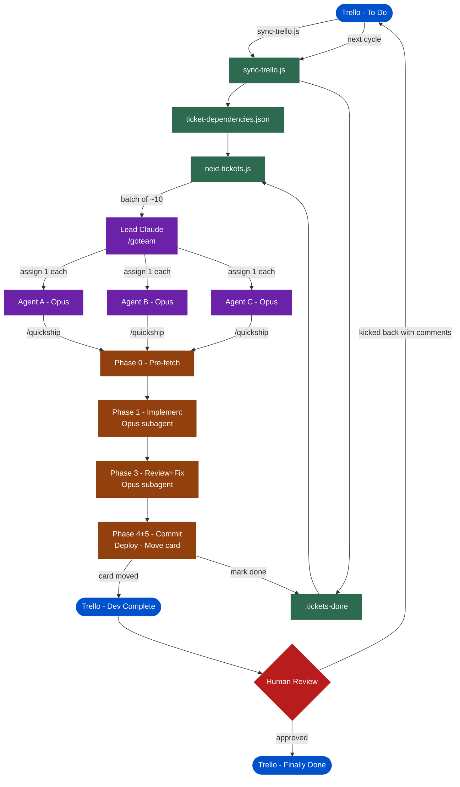

# QIC Team Orchestration

Multi-agent parallel ticket shipping using Claude Agent Teams. Three Opus workers run `/quickship` concurrently while a lead orchestrator tracks progress and manages dependencies.

---

## System Overview



---

## The Cycle

```
1. SETUP      One-time: worktrees + settings  (./aiteam/setup.sh)
2. LAUNCH     tmux new-session -s qic -> cd ~/git/qic -> claude -> /goteam
              Lead syncs Trello, reads board, creates 3 Opus workers, dispatches
3. BATCH END  ~10 tickets done -> workers stop, lead reports
4. REVIEW     Humans review in Trello; approve or kick back with comments
5. REPEAT     claude -> /goteam  (lead re-syncs Trello at startup automatically)
```

---

## Step 1: Setup (one-time)

### 1a. Enable Agent Teams

Create `.claude/settings.json` in `~/git/qic/`:

```json
{
  "env": { "CLAUDE_CODE_EXPERIMENTAL_AGENT_TEAMS": "1" },
  "teammateMode": "tmux"
}
```

### 1b. Create 3 git worktrees

```bash
# aiteam/setup.sh (see Scripts to Build below)
git worktree add ~/git/qic-worker-a -b worker-a main
git worktree add ~/git/qic-worker-b -b worker-b main
git worktree add ~/git/qic-worker-c -b worker-c main

# Then in each:
for d in ~/git/qic-worker-a ~/git/qic-worker-b ~/git/qic-worker-c; do
  git -C "$d" submodule update --init --recursive
done
```

Use `--clean` flag in the setup script to tear down and recreate.

### 1c. Generate initial ticket graph

`ticket-dependencies.json` must exist before any other step. Create it on first run:

```bash
node aiteam/sync-trello.js --dry-run  # preview only, no writes
node aiteam/sync-trello.js            # writes ticket-dependencies.json + .tickets-done
```

### 1d. Existing tools (no changes needed)

```
/quickship          Full pipeline: pre-fetch -> implement -> review -> commit -> deploy
/golive             Deploy + move Trello card (called internally by /quickship)
/git-commit         Autonomous commit across monorepo
/temper             Standalone deep code review
/ticket             Standalone ticket implementation (no commit)
aiteam/next-tickets.js     Query unblocked tickets, mark done
ticket-dependencies.json    Machine-readable dependency graph
.tickets-done               Tracks completed ticket IDs
```

---

## Step 2: Launch

> The lead handles sync and planning automatically. You just run `/goteam`.

```bash
cd ~/git/qic
tmux new-session -s qic   # must be inside tmux for worker panes to appear
claude
```

Then:

```
/goteam
```

That's it. The lead takes it from here autonomously:
1. Syncs Trello (`sync-trello.js`) - fresh board state
2. Reads the unblocked ticket pool (`next-tickets.js -w`)
3. Creates 3 Opus worker teammates in their worktrees
4. Picks a batch from the lowest incomplete wave
5. Enters the dispatch loop

See `.claude/commands/goteam.md` for the full orchestrator spec.

---

## Step 5: Dispatch Loop

```
Lead: node aiteam/next-tickets.js -n 10 -w

Lead -> Agent A: /quickship ES-006
Lead -> Agent B: /quickship AUTH-001
Lead -> Agent C: /quickship AFL-001

Agent A finishes (Ship Complete):
  Lead: node aiteam/next-tickets.js -m ES-006
  Lead -> Agent A: /quickship LDG-005

Agent C finishes:
  Lead: node aiteam/next-tickets.js -m AFL-001
  Lead -> Agent C: /quickship RESELLER-001

Agent B reports BLOCKED:
  Lead: [log] SKIPPED: AUTH-001 - "migration conflict with ES-007 changes"
  Lead -> Agent B: /quickship NOTIFY-002

...continues until batch exhausted
```

**Rules:**
- ONE ticket per agent at a time. Never more.
- Mark done ONLY after a confirmed "Ship Complete" in the Phase 6 report.
- Skipped (BLOCKED/FAILED) tickets are never marked done.
- After batch of ~10: STOP. Do not start a new batch.

**`/quickship` phases:**

```
Phase 0   Main:    pre-fetch ticket + comments + design docs
Phase 1   Subagent (Opus): implement - explore, clarify, types first, code, verify
Phase 2   Main:    capture diff
Phase 3   Subagent (Opus): review + fix loop - full build + tests
Phase 4   Main:    merge protocol -> commit -> push
Phase 5   Main:    deploy (Vercel + Heroku) + move Trello card + post comment + mark done
Phase 6   Main:    report
```

Agent context stays light because subagents die after each phase - only the structured return accumulates.

### Merge Protocol (Phase 4, before commit)

Each worker runs this before committing:

```bash
git fetch origin main
git log --oneline HEAD..origin/main      # what landed while you were working
git diff HEAD...origin/main --stat       # which files changed
# Read any files that overlap with your changes before rebasing
git rebase origin/main
# Resolve conflicts (you already read the incoming changes)
cargo check && bun run typecheck
# Then commit + push
```

**Submodule pointer conflicts during rebase:**
```bash
git checkout --theirs -- frontend qictrader-backend-rs
git add frontend qictrader-backend-rs
git rebase --continue
# Then re-verify both builds
```

### Failure Escalation

| Agent reports | Lead action |
|---|---|
| Ship Complete | `next-tickets.js -m TICKET-ID`, assign next |
| BLOCKED | Log reason, skip ticket, assign next |
| BUILD FAILED | Log error, skip ticket, assign next |
| TESTS FAILED | Log which tests, skip ticket, assign next |
| NEEDS_CLARIFICATION | Relay to human, pause that agent, continue others |

Skipped tickets are reported at batch end with their reason. They re-enter the pool on the next `sync-trello.js` run (they are still in To Do on Trello).

---

## Step 6: Batch End

When all ~10 tickets are shipped or skipped:

```bash
node aiteam/next-tickets.js -s
```

Lead reports:
```
Batch complete.
Shipped (8): ES-006, AUTH-001, AFL-001, LDG-005, ...
Skipped (2): AUTH-003 (merge conflict unresolvable), WS-002 (BLOCKED on ES-009)

[progress summary]
```

All workers stop. No new assignments until after human review.

---

## Step 7: Human Review

Humans review cards in Dev Complete on Trello:
- **Approve** - move to "Human Review" or "Finally Done"
- **Reject** - move back to "To Do" with a comment explaining what is wrong

The reviewer's comments are automatically picked up by `/quickship` when the ticket is re-assigned (Phase 0 fetches all card comments oldest-to-newest). No special handling is needed for rework.

---

## Step 8: Repeat

After human review, start a fresh Claude session (fresh context for lead):

```bash
cd ~/git/qic
claude
/goteam
```

The lead re-syncs Trello automatically at startup, picks up approvals and kickbacks, and dispatches the next batch.

---

## Scripts to Build

### 1. `aiteam/setup.sh`

Creates 3 git worktrees as siblings to `~/git/qic/`, initialises submodules in each. Supports `--clean` to tear down and recreate. ~50 lines of bash.

### 2. `aiteam/sync-trello.js`

Node.js script (~200 lines). Fetches Trello board via API, maps columns to done/undone states, updates `.tickets-done`, handles rework cascade-unmarking, and for new cards calls `claude -p` to infer dependencies.

**Key flags:**
- `--dry-run` - show proposed changes without writing (mandatory review step for new cards)
- `--board BOARD_ID` - override default board
- `--new-only` - only process new cards (skip done/undone sync)

The LLM dependency inference step receives: card name, description, comments, and the current dependency graph JSON. Output is reviewed by the human before being written. Dependency inference is fallible - treat it as a first draft, not ground truth.

### 3. `aiteam/next-tickets.js`

Already exists. Node.js. Queries unblocked tickets from `ticket-dependencies.json`, marks done, shows wave-based progress. Waves are derived dynamically from the JSON (no hardcoded limits).

```bash
node aiteam/next-tickets.js -n 10 -w   # top 10 unblocked with wave
node aiteam/next-tickets.js -m ES-006  # mark done
node aiteam/next-tickets.js -s         # progress summary
```

---

## Risks and Mitigations

```
Risk 1: Agent Teams is experimental
  - Lead session death = team is gone
  - Mitigation: batches of ~10, fresh session per cycle
  - Recovery: check git log in submodules, rebuild .tickets-done manually,
    start new /goteam session

Risk 2: Token cost
  - Lead + 3 Opus workers, each spawning 2 Opus subagents per ticket
  - Mitigation: sonnet workers for trivial tickets if cost becomes an issue
    (override in /goteam arguments)

Risk 3: Merge conflicts
  - 3 workers pushing to main concurrently
  - Mitigation: wave clustering (tickets in the same wave touch unrelated files),
    merge protocol (fetch + review + rebase before every commit),
    /golive already retries on push rejection with pull --rebase

Risk 4: Submodule pointer conflicts
  - When two workers both update frontend/ or qictrader-backend-rs/ pointer
  - Mitigation: merge protocol explicitly handles this with --theirs strategy
    for pointer files, followed by build re-verification

Risk 5: Dependency inference errors (new cards)
  - claude -p infers wrong dependencies from card text alone
  - Mitigation: --dry-run is mandatory, human approves before writing

Risk 6: Rework cascade gaps
  - A kicked-back ticket's downstream dependents may also need rework
  - sync-trello.js unmarks direct downstream dependents automatically
  - Human must decide if deeper cascade is needed case by case

Risk 7: Lead marks done before Ship Complete confirmed
  - Race condition if lead marks done on BLOCKED ticket
  - Mitigation: /goteam rules are explicit - mark done ONLY on Phase 6
    "Ship Complete" report, never on failure reports
```
