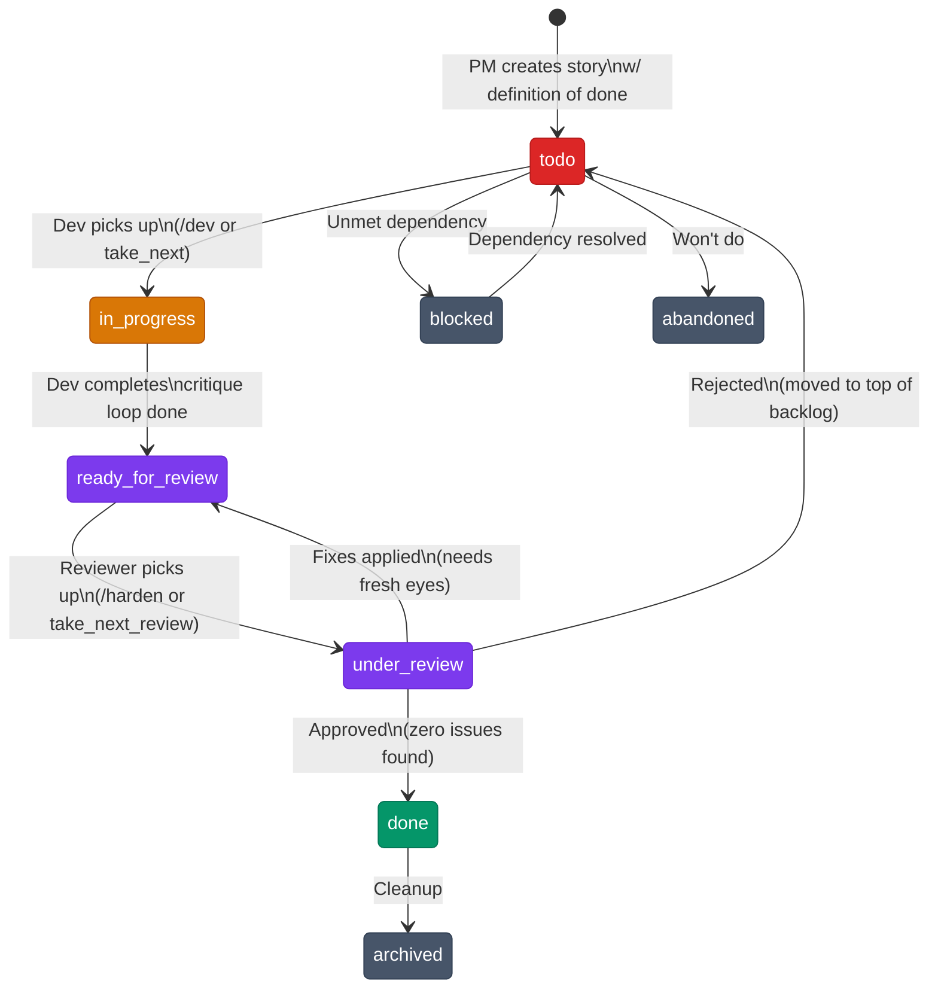
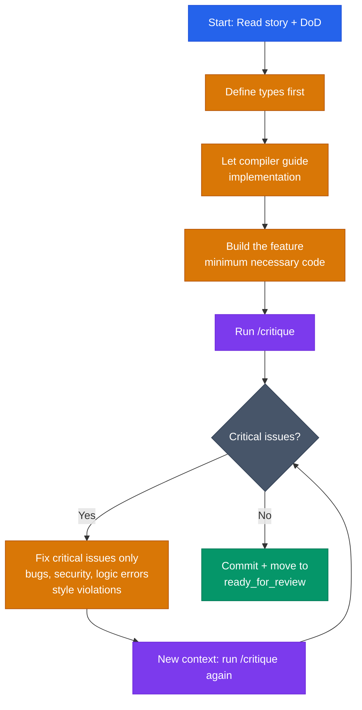
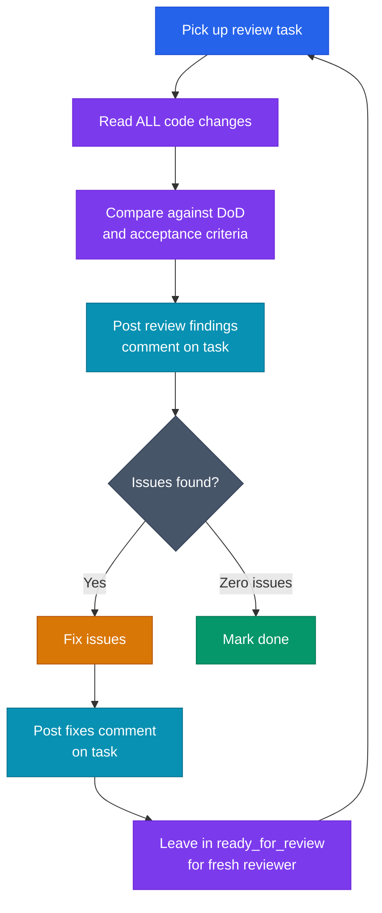
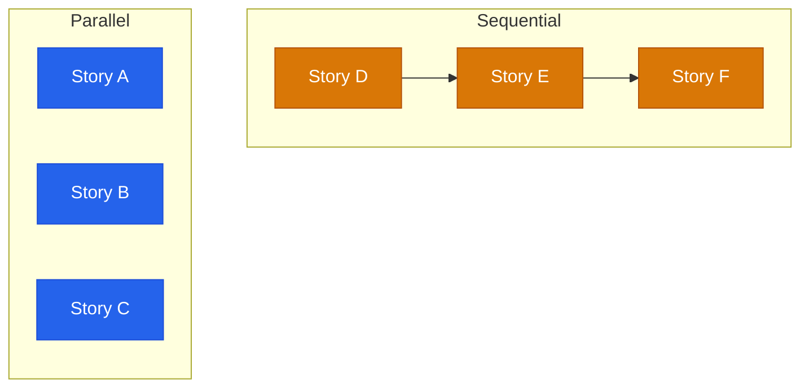
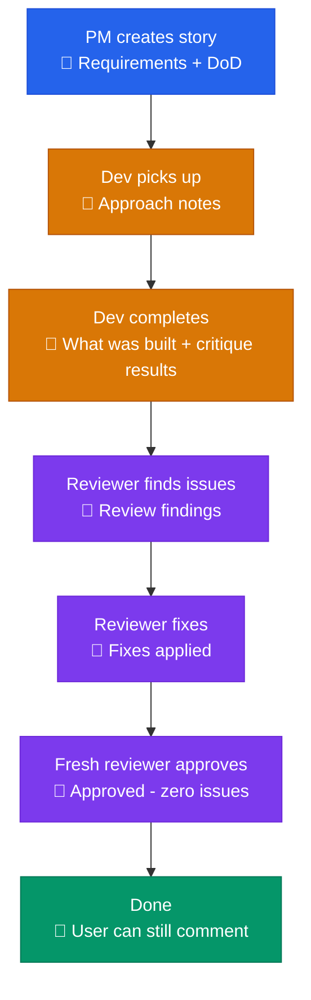
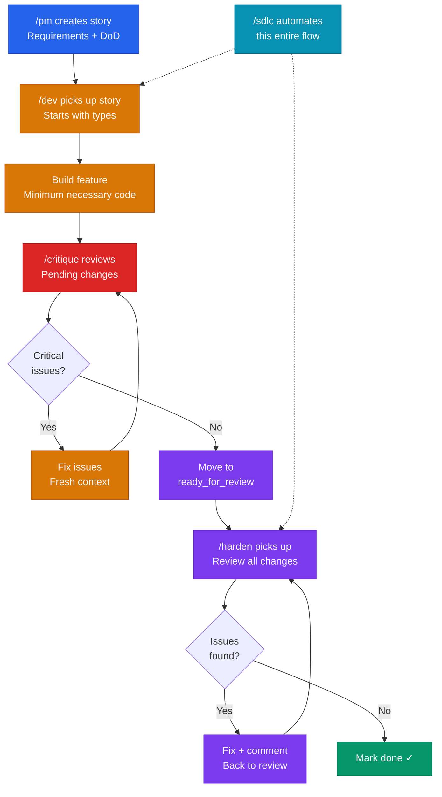

# Software Development Philosophy

Schalk's approach to building software — a type-driven, critique-looped, pull-based workflow designed for human-AI collaboration.

## Core Beliefs

1. **Projects contain stories** — a story is the atomic unit of deliverable work
2. **Start with the types** — let the compiler guide you to correctness
3. **YAGNI** — write the minimum necessary code, but no less
4. **Single commit cycles** — one story = one commit (or one feature branch for larger work)
5. **Critique loops** — build, critique, fix, repeat until clean
6. **Every transition gets a comment** — full audit trail from creation to done
7. **Testable definition of done** — every story has verifiable completion criteria

## Story Lifecycle

## The Development Loop (Build → Critique → Fix)

This is the core inner loop that happens while a story is `in_progress`:

### What /critique focuses on

| Priority | Category | Examples |
|----------|----------|---------|
| **HIGH** | Bugs | Logic errors, crashes, race conditions |
| **HIGH** | Security | Vulnerabilities, injection, auth gaps |
| **HIGH** | Logic inconsistencies | Code contradicts its own intent |
| **MEDIUM** | Style violations | Breaks project rules/conventions |
| **LOW** | Tangential | Minor style preferences, bikeshedding |

The developer decides which critique findings to fix. Tangential findings are often ignored. The loop repeats in a **fresh context** each time (to avoid anchoring bias).

## The Review Loop (Harden)

Once a story reaches `ready_for_review`, the harden loop takes over:

Key rules:
- **Always comment before fixing** — audit trail
- **Always comment after fixing** — documents what changed
- **Never mark done if you made fixes** — needs fresh eyes
- The `/sdlc` command automates this loop (dev → harden × N → done)

## Story Dependencies

- Stories without dependencies can be built **in parallel**
- Stories with dependencies must be built **in sequence**
- The PM system tracks `blocked_by` / `blocks` relationships with cycle detection

## The Comment Trail

Every status transition produces a comment. The full audit trail looks like:

## Definition of Done (DoD)

Every story must have a testable DoD before work begins. The default DoD is:

1. **Compiles** — zero build errors
2. **Tests pass** — all existing + new tests per acceptance criteria
3. **Acceptance criteria met** — every criterion verifiably satisfied
4. **No regressions** — what worked before still works
5. **Clean commit** — descriptive message referencing task ID

### Test Hierarchy

In order of preference:

1. **Property-based tests** — the gold standard for pure functions
2. **Integration tests** — for multi-component workflows
3. **Unit tests** — for isolated logic
4. **Manual testing** — only when automation is genuinely impractical

## Language Preferences

Preferred languages share a common trait: **strict type systems that catch errors at compile time**.

- **Rust** — systems, backend, CLI tools
- **Elm / Lamdera** — frontend, full-stack web apps
- **Haskell** — when maximum type safety matters
- **PureScript** — typed functional frontend alternative

The type system is not just a safety net — it's the **development methodology**. Start with types, let the compiler tell you what's missing.

## YAGNI in Practice

- Write the minimum code that satisfies the story's DoD
- No speculative features, no "might need this later"
- Three similar lines of code > premature abstraction
- If a helper is used once, inline it
- Simple and working beats elegant and theoretical

## Command Reference

| Command | Role | Purpose |
|---------|------|---------|
| `/pm` | Project Manager | Create stories with DoD, manage backlog |
| `/dev` | Developer | Pick up and implement stories |
| `/critique` | Code Reviewer | Review pending changes for critical issues |
| `/harden` | Hardener | Review → comment → fix → comment loop |
| `/sdlc` | Orchestrator | Automates dev → harden × N → done |
| `/review` | Reviewer | Manual review of tasks and bugs |

## End-to-End Flow

